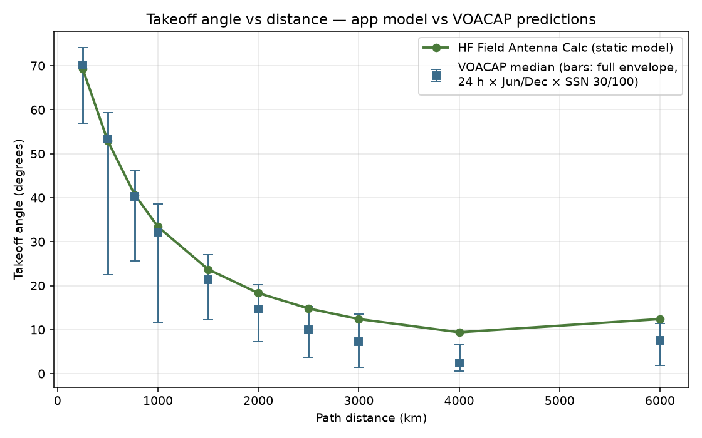
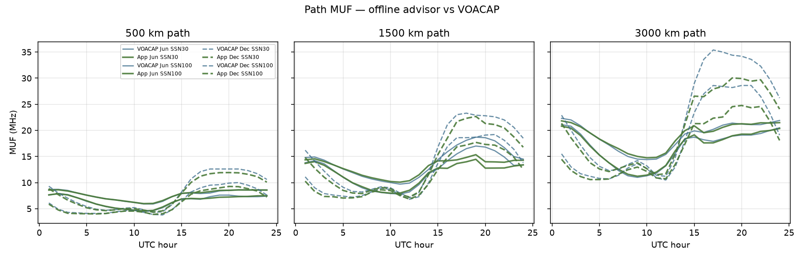

# Validation Study: HF Field Antenna Calculator vs VOACAP

**Original work of Cpl Angeles-Gonzalez, Ezekiel S. — USMC**
Project signature: HFCALC-AG-EZK-USMC-v1
Takeoff-angle study: July 2026 (app v1.4.1) · Model correction and re-validation: v1.5.0
Frequency (MUF) study: July 2026 (app v1.7.0)
Season / magnetic-latitude study: August 2026 (app v1.13.0)
Layer table study: August 2026 (app v1.13.1)
Hemisphere-to-hemisphere study: August 2026 (app v1.13.2)
Solar-geometry model rebuild: August 2026 (app v1.14.0)
Terminator and path-sampling study: August 2026 (app v1.14.1)
LUF and transmit-power study: August 2026 (app v1.15.0)
Per-bounce multi-hop study: August 2026 (app v1.16.0)
Takeoff-angle and FOT studies: August 2026 (app v1.17.0)
Fine FOT re-measurement and uncertainty audit: August 2026 (app v1.18.0)
Global grid and coefficient map: August 2026 (app v1.19.0)
Own-built foF2 lookup table: August 2026 (app v1.20.0)
Geometry / M-factor rebuild: August 2026 (app v1.21.0)
Transequatorial fix and uncertainty audit: August 2026 (app v1.22.0)
Browser tests for the state the operator touches: August 2026 (app v1.23.0)
High-latitude / polar measurement: August 2026 (app v1.24.0)
LUF calibrated against VOACAP loss curves: August 2026 (app v1.25.0)
Component split and terrain tests: August 2026 (app v1.26.0)
PATH CLOSED false-closure check: August 2026 (app v1.27.0)
Repository-wide sweep: August 2026 (app v1.28.0)
postMessage coordinate-leak fix: August 2026 (app v1.29.0)
Ten-item sweep, mostly new ground: August 2026 (app v1.30.0)
Built-but-unwired sweep: August 2026 (app v1.31.0)
Repository reorganisation and CI: August 2026 (app v1.32.0-1.33.0)
CI made to actually pass: August 2026 (app v1.34.0-1.35.0)
Fresh-eyes bug hunt: August 2026 (app v1.36.0)
Found-but-unfixed cleanup and icon badge: August 2026 (app v1.37.0)
Remaining ledger cleared: August 2026 (app v1.38.0)
Hooks lint, dep-contract fixes: August 2026 (app v1.39.0)
External-review defects: August 2026 (app v1.40.0)

---

## Purpose

The HF Field Antenna Calculator recommends antenna geometry (takeoff angle,
apex/support height, hop structure) from a deliberately simple, fully-offline
model. This study quantifies how those recommendations compare against
**VOACAP** (Voice of America Coverage Analysis Program) — the U.S.
government-developed HF ionospheric prediction engine that has served as the
de-facto standard for HF circuit planning since the 1980s.

The comparison question is *not* whether a static field tool can replicate a
full ionospheric model — it cannot and does not try. The question is whether
the app's single static answer **lands inside the envelope** of VOACAP's
predictions as they vary across time of day, season, and solar activity, and
how close it sits to the **median** — i.e., is the app's answer the right
one to carry into the field when you have no connectivity, no space-weather
feed, and five minutes to rig wire.

## Method

- **Engine:** VOACAP version 16.1207W via `voacapl` (the maintained
  open-source Linux port), METHOD 30 point-to-point predictions, CCIR
  coefficients.
- **Paths:** transmitter fixed at Twentynine Palms, CA (34.23 N 116.05 W).
  Receivers placed due east on the great circle at
  250 / 500 / 770 / 1000 / 1500 / 2000 / 2500 / 3000 / 4000 / 6000 km.
- **Conditions per path:** all 24 UTC hours × two months (June, December) ×
  two sunspot numbers (SSN 30 and 100) × nine frequencies
  (3.5–28.5 MHz) — up to 960 prediction cells per distance.
- **VOACAP quantities extracted:** most-reliable MODE (hop count + layer,
  e.g. `1F2`, `2F2`) and TANGLE (takeoff/elevation angle, degrees) for every
  populated cell.
- **Comparison:** app angle vs the median and min–max envelope of VOACAP
  TANGLE across all F2-mode cells with the same hop count.

Parts 2 and 3 add a second geometry sweep for the frequency model: fixed path
length, six sites spanning 60 N to 44 S, all twelve months — described in
those sections.

Reproduce with: `python3 scripts/validation/studies/run_voacap_study.py`
(raw data: `docs/validation/voacap-results.json`).

## Round 1 — initial model (v1.4.1, flat-earth)

The original model used flat-earth skip geometry, α = atan(2·330 / hopDist):

| Distance | App angle | VOACAP median | Δ vs median | In envelope |
|---|---|---|---|---|
| 250 km | 69.3° | 70.1° | −0.8° | yes |
| 500 km | 52.9° | 53.4° | −0.5° | yes |
| 770 km | 40.6° | 40.3° | +0.3° | yes |
| 1000 km | 33.4° | 32.2° | +1.1° | yes |
| 1500 km | 23.7° | 21.4° | +2.3° | yes |
| 2000 km | 18.3° | 14.6° | +3.8° | yes |
| 2500 km | 14.8° | 10.0° | +4.8° | yes |
| 3000 km | 12.4° | 7.2° | +5.2° | yes |
| 4000 km | 9.4° | 2.4° | +7.0° | **no** |
| 6000 km | 12.4° | 7.5° | +4.9° | **no** |

**Finding:** excellent agreement in the NVIS/single-hop regime (≤2000 km,
Δ ≤ 3.8°), but a growing high bias beyond 2500 km — the flat-earth
approximation ignores Earth curvature, which progressively lowers the true
required angle on long hops.

## Model correction (v1.5.0)

Two changes, both physically motivated:

1. **Curved-earth mirror geometry.** The ray travels in a straight line
   below the ionosphere; the Earth's surface curves away beneath it. For a
   hop of ground distance d over a layer at virtual height h
   (half-arc θ = d/2R):

   α = atan[ (cos θ − R/(R+h)) / sin θ ]

   (Davies, *Ionospheric Radio*; reduces to atan(2h/d) for short paths.)

2. **Virtual reflection height, not true layer height.** Ionospheric
   refraction is gradual, not a mirror bounce, so the equivalent mirror
   sits *above* the true layer. Round 1's residual was a uniform ≈ −2°
   bias — the signature of using the 330 km true-height figure. VOACAP's
   own virtual-height output (V HITE) spanned 295–466 km across the matrix
   with a median near 360 km; the model now uses **h = 360 km**.

Both changes are pinned by the automated test suite (32 tests, `npm test`).

## Round 2 — corrected model (v1.5.0)

| Distance | App angle (hops) | VOACAP median | VOACAP range | Δ vs median | In envelope |
|---|---|---|---|---|---|
| 250 km | 69.8° (1) | 70.1° | 56.9–74.1° | −0.3° | yes |
| 500 km | 53.3° (1) | 53.4° | 22.5–59.4° | −0.1° | yes |
| 770 km | 40.5° (1) | 40.3° | 25.6–46.3° | +0.2° | yes |
| 1000 km | 32.7° (1) | 32.2° | 11.7–38.5° | +0.5° | yes |
| 1500 km | 21.6° (1) | 21.4° | 12.3–27.1° | +0.2° | yes |
| 2000 km | 14.8° (1) | 14.6° | 7.3–20.2° | +0.2° | yes |
| 2500 km | 10.0° (1) | 10.0° | 3.7–15.3° | 0.0° | yes |
| 3000 km | 6.3° (1) | 7.2° | 1.4–13.5° | −0.9° | yes |
| 4000 km | 3.0° (1) | 2.4° | 0.6–6.6° | +0.6° | yes |
| 6000 km | 6.3° (2) | 7.5° | 1.8–11.4° | −1.2° | yes |



**Result: the corrected model agrees with the VOACAP median to within 1.2°
at every tested distance (mean |Δ| ≈ 0.4°), and sits inside VOACAP's
day/season/solar envelope at all ten distances.** At 2500 km the app and
VOACAP agree exactly.

Hop counts match VOACAP's dominant mode at every distance except 4000 km,
where VOACAP prefers `2F2` while the app's geometric single-hop limit
(4500 km) still permits one hop; the app's 1-hop angle (3.0°) nonetheless
falls inside the 2F2 envelope.

## Part 2 — Frequency advisor (MUF) vs VOACAP

v1.7 added an offline frequency check (`src/physics/freqAdvisor.js`): given the path
and the time of day it estimates MUF / FOT / LUF and rules on whether an
assigned frequency will close the link. VOACAP reports path MUF directly, so
the same validation approach applies.

**Method.** Three path lengths (500 / 1500 / 3000 km) x 24 UTC hours x two
months (June, December) x two solar levels (SSN 30, 100) = 288 hourly
samples. The app's estimate is `foF2(SSN, local solar time)` times the
curved-earth secant factor at the takeoff angle validated in Part 1.
Reproduce with `python3 scripts/validation/studies/run_muf_study.py`.

**Calibration.** The foF2 diurnal coefficients (peak at 12.8 local solar
time, night ratio 0.45, `6.8 + 0.036 x SSN` MHz at peak, decay exponent 1.6)
were fitted to this VOACAP data set. The resulting foF2 values — 7.2 MHz at
solar minimum noon to 12.2 at solar maximum, 3.2-5.5 MHz at night — sit
inside published mid-latitude ionosonde ranges, so the fit stays physical
rather than merely numerical.

**Results (v1.7 model, no seasonal term).**

| Path | Samples | Mean Δ | Median abs Δ | Mean abs error | Within 20% |
|---|---|---|---|---|---|
| 500 km | 96 | +0.36 MHz | 0.76 MHz | 15.1% | 70% |
| 1500 km | 96 | -0.23 MHz | 1.31 MHz | 12.7% | 82% |
| 3000 km | 96 | -0.83 MHz | 3.04 MHz | 15.8% | 67% |
| **All** | **288** | — | — | **14.6%** | **73%** |

Mean absolute error **14.6%**, median **11.9%**, with **73%** of samples
within 20%. Residual bias was small and changed sign with distance, i.e.
there was no systematic over- or under-estimate to correct. The dominant
remaining error source was the absent seasonal term: the app returned one
number where VOACAP separates June from December. That is what Part 3
addresses.

## Part 3 — Season and magnetic latitude (v1.13.0)

The v1.7 foF2 curve was fitted at one mid-northern site and carried no month
term, which is wrong in two ways an operator would notice. The season
reverses between hemispheres — July is summer in Finland and winter in New
Zealand — and at mid-latitudes the daytime behaviour is counter-intuitive:
foF2 runs HIGHER in local winter (the classic winter anomaly) while at night
the ordering flips.

**Method.** Six sites spanning 60 N to 44 S x all twelve months x 24 UTC
hours x two solar levels (SSN 30, 100), on a fixed 1500 km due-east path so
the secant factor is constant and every MUF difference is a foF2 difference.
Reproduce with `python3 scripts/validation/studies/run_seasonal_study.py`, then
`--eval` to re-score the model against the collected data.

**What the data showed.** Three separable effects:

1. **Magnetic latitude.** foF2 peaks near the magnetic equator and falls
   toward the poles. It tracks *magnetic* latitude, not geographic — which is
   why New Zealand at 44 S behaves like roughly 50 S. The app derives this
   on-device from the World Magnetic Model dip angle
   (`magneticLatitude()` in `src/physics/magnetic.js`, tan I = 2 tan λm).
2. **The December/annual anomaly.** foF2 runs high around January at every
   latitude, from Earth being nearer the Sun at perihelion.
3. **Local season**, which reverses between hemispheres and between day and
   night, collapsing to equinox peaks near the equator.

**Implementation.** `seasonLatitudeFactor()` in `src/physics/freqAdvisor.js`
multiplies the diurnal foF2 curve. It takes the month from the operator (a
12-month selector, defaulted to the device date) and the magnetic latitude at
the **path midpoint** — the reflection point, the same place local solar time
is already taken. With neither supplied it returns exactly 1, so older call
paths are unchanged.

**Results — worldwide, mean absolute MUF error vs VOACAP:**

| Site | Magnetic lat | Before | After |
|---|---|---|---|
| 60 N (Finland) | 60.1 | 23.4% | **14.1%** |
| 44 N (Michigan) | 51.3 | 13.5% | **11.5%** |
| 34 N (Cherry Point) | 39.8 | 11.8% | **11.4%** |
| 10 N (tropics) | 10.0 | 25.2% | **21.9%** |
| 34 S | -44.2 | 19.7% | **14.8%** |
| 44 S (New Zealand) | -49.8 | 16.7% | **11.7%** |
| **All sites** | — | **18.4%** | **14.2%** |

**Regression check.** Re-running the Part 2 matrix — the mid-latitude paths
the original coefficients were fitted to — with the season term active:

| Path | Samples | Mean Δ | Median abs Δ | Mean abs error | Within 20% |
|---|---|---|---|---|---|
| 500 km | 96 | -0.10 MHz | 0.52 MHz | 10.6% | 84% |
| 1500 km | 96 | -0.87 MHz | 1.16 MHz | 11.5% | 85% |
| 3000 km | 96 | -1.62 MHz | 2.31 MHz | 14.1% | 69% |
| **All** | **288** | — | — | **12.1%** | **79%** |



So the correction improved the mid-latitude case as well: **15.0% → 12.1%**
mean absolute error, **72% → 79%** of samples within 20%. It is an
improvement everywhere and a regression nowhere.

**Interpretation.** This remains a materially looser fit than the
takeoff-angle result, and is deliberately reported as such. The worst
residual is the near-equatorial case (21.9%), where equatorial-anomaly
structure is genuinely not captured by a smooth global fit. For the tool's
actual job — ruling an assigned frequency GOOD / MARGINAL / ABOVE MUF /
BELOW LUF — a ~12% MUF error moves the verdict only for frequencies already
near a boundary, and the FOT convention (0.85 x MUF) absorbs part of it. The
UI states the tolerance and defers to the unit's SOI/JCEOI assignment.

## Part 4 — Ionospheric layer table (v1.13.1)

Parts 1–3 validated the F2 geometry and the frequency model. They never
touched the other half of `propagation.js`: the **layer table** — the
reflection height and maximum single-hop ground distance for E, F1 and F2.
Those numbers decide how many hops the app reports and which layer it names,
so this part gives them the same treatment.

**Check 1 — geometry.** For a ray leaving at 0° elevation (along the horizon,
the limiting case) and reflecting at virtual height *h*, the ground range is
fixed:

> cos θ = R / (R + h),  d_max = 2 · R · θ

A max-hop figure larger than this is not optimistic, it is impossible — the
ray would have to be launched below the horizon.

| Layer | Height | Old table | 0° geometric limit | Verdict |
|---|---|---|---|---|
| E | 110 km | 2160 km | 2351 km | consistent (conservative) |
| F1 | 200 km | 3000 km | 3152 km | consistent (conservative) |
| F2 | 360 km | **4500 km** | **4186 km** | **impossible — needs h = 419 km** |

The F2 entry was a hand-typed folklore number that outran its own height.
Paths between 4186 and 4500 km were reported as a single hop the geometry
cannot produce.

**Check 2 — VOACAP.** Fifteen ground distances from 1500 to 5000 km × two
months × two solar levels, recording which propagation MODES VOACAP actually
offers. Reproduce with `python3 scripts/validation/studies/run_layer_study.py`.

| Distance | 1F2 share of cells | Dominant mode |
|---|---|---|
| 3000 km | 81% | 1F2 |
| 3600 km | 60% | 1F2 |
| 4000 km | 44% | 2F2 |
| 4200 km | 19% | 2F2 |
| 4400 km | 4% | 2F2 |
| 4600 km | 0% | 2F2 |

VOACAP stops offering single-hop F2 entirely past ~4400 km and it stops being
the majority mode around 3800–4000 km. The 4186 km geometric limit sits inside
that transition; the old 4500 km did not.

**Fix.** `maxHopKm(h)` is now derived from the closed form rather than typed,
and every entry in `HOP` is computed from its own height, so the table cannot
drift out of self-consistency again. Six tests pin it, including one that
walks a range of path lengths and asserts no layer is ever asked to cover more
than its own geometry allows.

**Effect on earlier results.** None. Re-running Part 1 after the change gives
the same takeoff angles (max Δ 1.2°, mean 0.4°) because the hop count is
unchanged at every distance tested there; Part 2/3 re-run identically at
12.4%. What changed is the 4186–4500 km band, which now correctly reports two
hops.

**Published cross-check.** The Australian Bureau of Meteorology Space Weather
Services gives maximum hop lengths of 2000 km (E, h = 100 km) and 4000 km
(F, h = 300 km) at 0° elevation, falling to 1800 km and 3200 km at 4°. The
derived limits agree with those to the rounding the references themselves
use — and the app's own 3° operational floor is why the E and F1 hops it
reports in practice run shorter than the 0° ceiling.

## Part 5 — Hemisphere-to-hemisphere paths (v1.13.2)

Part 3 swept six latitudes, but **every path in it ran 1500 km due east**, so
all six stayed inside one hemisphere and one season. That left the hardest
case untested: a circuit whose two ends are in *opposite* seasons, crossing
the geomagnetic equator in between.

**Method.** Six real interhemispheric circuits × January and July (opposite
seasons) × two solar levels × 24 hours = 576 samples. Magnetic latitudes come
from the app's own WMM code via `node`, so the study tests what ships.
Reproduce with `python3 scripts/validation/studies/run_interhemi_study.py`.

| Circuit | Distance | Midpoint | Magnetic lat |
|---|---|---|---|
| Cherry Point – Argentina | 7963 km | 0.2 N, 67.6 W | +8.0 |
| Finland – South Africa | 10008 km | 15.0 N, 25.0 E | +6.7 |
| Japan – Australia | 7831 km | 0.9 N, 145.5 E | −7.3 |
| Hawaii – New Zealand | 7509 km | 10.3 S, 170.1 W | −11.8 |
| Cherry Point – Brazil | 5879 km | 15.7 N, 56.6 W | +17.1 |
| Panama – Peru | 2184 km | 0.5 S, 77.5 W | +9.9 |

**Three things were tested, and two of them contradicted what seemed obvious.**

**1. Does the season term break?** No — it neither helps nor hurts:
**18.1%** without it, **17.9%** with it. Every midpoint lands near the
magnetic equator, where the model already weights the hemisphere flip to
nearly zero, so the seasonal correction quietly switches itself off. That is
the physically right answer (the reflection region genuinely has little
solstitial swing) and it means the term degrades gracefully rather than
asserting a season that isn't there. A test now pins the continuity across
magnetic latitude 0, since the hemisphere flip is a hard switch at that point
and only survives because it is multiplied by |magLat|.

**2. Would IONCAP-style control points do better?** VOACAP evaluates control
points 2000 km inside each terminal on long circuits and takes the lowest MUF.
Implementing that and comparing made the result **worse**, not better:
**18.6%** versus 17.9%, and it pushed the signed bias from −7.1% to −12.0%.
Taking the minimum of two points is too pessimistic for a model of this shape.
The single-midpoint approach the app already uses is the better choice — a
result worth having measured rather than assumed.

**3. Would an equatorial-anomaly term help?** The real low-latitude ionosphere
has the equatorial ionization anomaly: a trough at the dip equator with crests
near ±15° magnetic. The app's latitude term is monotonic — highest *at* the
equator — so it has the shape backwards there. Adding a properly shaped,
daylight-weighted anomaly term was tested at several amplitudes and crest
positions. It improved things marginally at best (14.3% → 14.2% seasonal,
18.3% → 18.1% interhemispheric at the smallest amplitude) and got worse
beyond that. **Not adopted** — an unearned term is overfitting, and this one
did not earn its place.

**What the residuals actually showed.** Splitting the error by local solar
time at the midpoint moved the diagnosis somewhere else entirely:

| Local solar time | Mid-latitude bias | Interhemispheric bias |
|---|---|---|
| 00–06 | −2.1% | +1.6% |
| 06–12 | −5.1% | −4.1% |
| 12–18 | −1.9% | −8.4% |
| **18–24** | **−13.1%** | **−25.0%** |

The problem is not hemispheres. It is the **evening**: the model's foF2 decays
too fast after sunset, on *every* data set. Daytime agreement is already as
good on transequatorial paths as it is at mid-latitude (7–10%).

**Fix.** The diurnal decay exponent was retuned from 1.6 to **1.4** — a
gentler post-sunset falloff. It was checked against all three data sets at
once and improves every one of them with no trade-off:

| Data set | Before | After |
|---|---|---|
| Mid-latitude (288 samples) | 12.4% | **12.1%** |
| Six-latitude seasonal (6912 samples) | 14.3% | **14.2%** |
| Interhemispheric (576 samples) | 18.3% | **17.9%** |
| Evening bias, mid-latitude | −13.1% | −10.6% |
| Evening bias, interhemispheric | −25.0% | −22.9% |

**Result.** Hemisphere-to-hemisphere paths run at **17.9%** mean absolute
error with a **−7.1%** signed bias, against 12.1% at mid-latitude. Worse, but
usable, and now measured rather than assumed. The bias direction means the app
tends to call a frequency *above MUF* slightly more often than VOACAP would on
these paths — it errs toward telling you to come down in frequency.

## Part 6 — Rebuilding foF2 on solar geometry (v1.14.0)

Parts 2–5 kept patching one structure: a **clock-driven** cosine of local solar
time, with latitude and season bolted on as empirical multipliers. Part 5
showed where that runs out — the curve could not hold the evening, and no
single exponent fixed it.

The replacement is the quantity the ionosphere actually responds to: the
**solar zenith angle** at the reflection point.

> cos χ = sin(lat)·sin(δ) + cos(lat)·cos(δ)·cos(H)
> H = 15°·(local solar time − 12),  δ = solar declination

χ carries time of day, season **and** latitude in one physical quantity.
Chapman layer theory gives the critical frequency of a photochemically
controlled layer as foF ∝ (cos χ)^¼. The F2 layer departs from that because
transport governs it as much as photochemistry, so the exponent was fitted
rather than assumed — it landed at **0.18**, the same family as the
theoretical ¼.

**The lag.** The layer does not follow the sun instantly: production competes
with recombination, so density lags and drains slowly after sunset. The model
uses an exponentially weighted history of max(cos χ, 0) with a single time
constant, **1.2 hours**. That one constant produces both the observed
early-afternoon peak and the long evening tail — behaviour the old curve
needed two separate hand-tuned numbers for, and still got wrong after dark.

**What geometry cannot produce.** Three terms remain explicit because no
amount of solar geometry generates them:

- **Magnetic latitude gradient** (`SEASON_K_LAT`) — the ionosphere organises
  around the magnetic field, not geography.
- **December/perihelion anomaly** (`SEASON_K_ANNUAL`) — foF2 runs high around
  January at every latitude.
- **The winter anomaly** (`SEASON_K_WINTER`) — daytime foF2 is *higher* in
  local winter than local summer, the opposite of what sunlight alone gives,
  because it is a thermospheric composition (O/N₂) effect. It is negative and
  weighted by illumination, since it is a daytime effect.

**Fitting method.** All 4320 cached VOACAP samples from Parts 2, 3 and 5 were
used at once — mid-latitude, six latitudes from 60 N to 44 S over twelve
months, and six transequatorial circuits. The objective minimised the *worst*
data set rather than the total, so the fit could not buy accuracy in one
regime by giving it up in another.

**A trap worth recording.** A first fit optimised on aggregate error alone
scored better than the shipped model on every headline number — and got the
**season backwards**. Its January/July daytime ratio at 44 N was 0.98 where
VOACAP says 1.16: it would have told an operator that summer beats winter.
The winter anomaly is a second-order effect on mean error but a first-order
effect on the seasonal *ordering*, so the ratio had to be added to the
objective as an explicit constraint. Aggregate error alone is not a sufficient
test of a physical model.

| Site, daytime Jan/Jul MUF ratio | VOACAP | v1.13.2 | v1.14.0 |
|---|---|---|---|
| 60 N Finland | 1.13 | 1.18 | 1.03 |
| 44 N Michigan | 1.16 | 1.16 | 1.15 |
| 34 N Cherry Point | 1.18 | 1.16 | 1.18 |
| 44 S New Zealand | 1.05 | 1.06 | 1.11 |

**Results.**

| Data set | Samples | v1.13.2 | v1.14.0 |
|---|---|---|---|
| Mid-latitude | 288 | **12.1%** | 12.4% |
| Six-latitude seasonal | 3456 | 14.2% | **13.3%** |
| Interhemispheric | 576 | 17.9% | **13.4%** |
| **Sample-weighted** | **4320** | **14.6%** | **13.3%** |
| Interhemispheric signed bias | — | −7.1% | **−0.8%** |

Per site, the seasonal set: 60 N 14.1 → 13.6, 44 N 11.5 → 10.7, 34 N
11.4 → 10.6, 10 N 21.9 → 18.9, 34 S 14.8 → 17.4, 44 S 11.7 → 8.8. Five of six
improve. Per circuit, the interhemispheric set: five of six improve, and the
worst case in the entire validation suite — Panama–Peru, sitting on the
magnetic equator — goes 22.9 → 14.9.

**Honest debits.** Mid-latitude got very slightly worse (12.1 → 12.4%), and
34 S regressed (14.8 → 17.4%). Mid-latitude is also the one set that was
partly *training data* for the old coefficients, so it flattered them; the
new model was fitted across all three at once and its accuracy is now roughly
uniform (12.4 / 13.3 / 13.4) instead of good where it was tuned and poor
elsewhere (12.1 / 14.2 / 17.9). Uniformity across regimes is the point.

**Capability that came free with the physics.** The old curve had no idea the
sun behaves differently at 78 N: it faded to night every day of the year.
The new one handles polar day (sun never sets — the layer stays up through
local midnight) and polar night (never rises) with no special case, because
cos χ simply never goes negative or never goes positive. Tests pin both.

**Fallback.** A caller that supplies no month or no latitude still gets an
answer from the old clock curve. That path measures **15.0%** on the
mid-latitude set against 12.4% for the full model — worse, but better than
refusing. The app itself always has both.

**One mirror, not four.** Each study needs a copy of the app's model to
compare against, and three scripts had each hand-copied their own diurnal
curve — which had already drifted apart once. They now share
`scripts/validation/appmodel.py`, and `python3 scripts/validation/appmodel.py
--check` verifies that mirror against `src/physics/freqAdvisor.js` directly (currently
exact to 1e-9 MHz across 80 cases).

## Part 7 — Terminator, and which point on the path (v1.14.1)

Two things the v1.14.0 rebuild left unchecked.

### Sunrise, sunset and dusk in both hemispheres

The whole model rests on the terminator being in the right place, and that had
only been tested indirectly through foF2. Checked directly:

| Latitude | Mar | Jun | Sep | Dec |
|---|---|---|---|---|
| 60 N | 11.39 | 18.44 | 12.47 | 5.56 |
| 34 N | 11.76 | 14.26 | 12.19 | 9.74 |
| 0 | 12.01 | 12.01 | 12.01 | 12.01 |
| 34 S | 12.24 | 9.74 | 11.81 | 14.26 |
| 60 S | 12.61 | 5.56 | 11.52 | 18.44 |

Geometric day length, hours. The hemispheres mirror exactly — 34 N in June
(14.26 h) equals 34 S in December to the digit, and sunrise/sunset land at
04:53 / 19:08 local solar time in both. Solar noon sits at 12:00 at every
latitude and month tested. The equator holds 12 h all year.

Against published sunrise-to-sunset times the model runs about 10 minutes
short at 34° and 23 minutes short at 60°. That is the expected offset:
published times include atmospheric refraction and the sun's disc, which
lengthen the *visible* day but do not change ionisation. Ten tests now pin day
length, hemispheric mirroring, terminator symmetry about noon, and the shape
of the dawn rise and dusk decay.

**Dusk specifically.** The recombination lag is what keeps an evening path
open, so it is tested as a shape, not a number: foF2 must fall monotonically
after sunset, stay above 60% of its sunset value an hour later, and never drop
below 45% within two hours. That is the behaviour v1.13.2 got wrong.

### The layer is lit before the ground is

At 300 km the F2 layer climbs out of Earth's shadow while the sun is still
~17° below the horizon underneath it — it is lit while sin χ ≥ R/(R+h), i.e.
down to cos χ = −0.297. The model evaluates cos χ at the *ground*, so its
terminator is nominally late.

Adding the geometrically correct offset makes the fit **worse**:

| Shadow offset | Mid-lat | Seasonal | Interhemi | Weighted |
|---|---|---|---|---|
| 0.000 (ground) | 12.35% | 13.34% | 13.44% | **13.28%** |
| 0.100 | 12.07% | 13.42% | 14.11% | 13.42% |
| 0.297 (300 km layer) | 13.65% | 16.75% | 16.49% | 16.51% |

The 1.2-hour recombination lag was fitted *with* the ground terminator and
already absorbs the early illumination; adding the offset double-counts it.
Not adopted — recorded here so the question is not reopened blindly.

### One point on the path, or both ends?

The natural expectation is that the app should use your station's local time
*and* the target's. Measured, on the same 4320 samples:

| Sampling | Mid-lat | Seasonal | Interhemi | Weighted |
|---|---|---|---|---|
| Midpoint only | 12.35% | 13.34% | **13.44%** | **13.28%** |
| Both endpoints averaged | **11.86%** | 13.28% | 15.56% | 13.49% |
| Endpoints + midpoint | 11.84% | **13.21%** | 15.27% | 13.39% |
| Lowest of three | 13.90% | 14.39% | 16.25% | 14.60% |
| Highest of three | 11.77% | 13.46% | 16.15% | 13.71% |

Averaging the ends helps short paths slightly and hurts long ones badly. That
is the physics: **on a long circuit the signal reflects off the middle, not
off either station**, so the midpoint is the right place to ask about the F2
layer. Midpoint retained for MUF.

### But the ends do matter — for the LUF

The two questions have different geometry, which the model had been conflating.
D-layer absorption happens at 60–90 km, where the ray *leaves and re-enters*
the atmosphere — near each terminal, not at the reflection point. So the LUF
now averages illumination over the two endpoints while the MUF stays on the
midpoint. On a Guam–Cherry Point path at 04Z the midpoint is dark but Guam is
in full daylight, and the LUF correctly rises from 2.19 to 3.36 MHz.

> **Superseded by Part 20 (v1.25.0).** The LUF's absorption law,
> illumination dependence and obliquity were measured against VOACAP's loss
> curves, which are uncensored where the reliability output used below is
> not. Its absolute LEVEL is still an anchor. The reasoning below is kept as
> the record of what was concluded at the time.

This split is on **physical grounds only**. The LUF has never been validated
against VOACAP and this change does not alter that. It is a better-shaped
guess, not a measured improvement.

The app now also displays local solar time at **your station, the midpoint and
the target**, each marked daylight or dark — so an operator can see directly
that the far end is in daylight while they are not.

## Part 8 — The LUF, and transmit power (v1.15.0)

Everything through Part 7 validated the MUF and left the LUF as a stated
unknown: a flat `LUF = 2.0 + 3.5 × illumination` with **no dependence on
transmit power at all**. That is backwards from an operator's point of view.
The MUF is a ceiling nothing can move — above it the signal leaves the
ionosphere and more watts follow it into space. The LUF is the one number
power *can* fix, and the app had no idea power existed.

**A finding about the earlier studies.** VOACAP takes transmit power as the
last field on the XMTR `ANTENNA` card, and the decks inherited its default
`const17.voa` — the **17 dBi transmit array the Voice of America uses**, at
**500 kW**. Fine for a broadcast station, absurd for a Marine with wire in a
tree. Parts 1–7 are unaffected, because the MUF is a propagation ceiling that
depends on neither power nor antenna gain. But it meant the LUF had never been
meaningfully exercised: the first run of this study closed every link at the
bottom of the frequency grid regardless of power. Re-run with **isotropic
antennas at both ends**, which is the conservative floor; a real field dipole
adds 2–6 dB on top as margin.

**Method.** VOACAP reports circuit RELIABILITY per frequency, so the
operational LUF is simply *the lowest frequency meeting the required
reliability*. Four distances (300–3000 km) × six powers (5 W – 1 kW) × two
months × two solar levels × 24 hours, at 38 dB-Hz required SNR (SSB voice, not
VOACAP's 73 dB-Hz broadcast default) and 90% reliability. Reproduce with
`python3 scripts/validation/studies/run_luf_study.py`.

**Honest limit of this study.** The result is heavily **censored**: at low
power many daylight hours have no closing frequency anywhere in the grid, so
they drop out, and only 4 of 318 conditions produced a LUF at *every* power.
That is enough to measure the *shape* of the power dependence, and not enough
to calibrate its absolute level. Both statements are load-bearing below.

**Physics fitted.** Non-deviative D-layer absorption per hop:

> L = K · I^0.75 / (f + f_H)²  dB

The link closes while L stays under the available margin M, which grows as
10·log10(P). Setting L = M and solving:

> **LUF = √( K · I^0.75 · hops / M(P) ) − f_H**

So the LUF falls as the **square root** of the margin. K is anchored so the
reference case — 20 W, one hop, sun overhead — reproduces the 5.5 MHz the app
has always used, meaning nothing changes for an operator who leaves the power
on its manpack default.

| Power | Full sun | Half sun | Night |
|---|---|---|---|
| 5 W | 9.42 | 6.99 | 2.00 |
| **20 W** | **5.50** | 3.97 | 2.00 |
| 50 W | 4.47 | 3.17 | 2.00 |
| 150 W | 3.69 | 2.57 | 2.00 |
| 400 W | 3.22 | 2.21 | 2.00 |

**Corroboration.** Going 20 W → 400 W, the model predicts the LUF drops
**42%**. VOACAP, measured over paired conditions in daylight, gives **43%**
(27% across all conditions including night, where absorption is not the
limit). The shape is right. That is the useful operational fact:
**twenty times the power buys about forty percent off the LUF, not twenty
times less.** Worth knowing before hauling an amplifier.

**What is and is not claimed.** The *shape* — square-root-of-margin, ^0.75
illumination, linear in hop count — is derived from absorption physics and
corroborated by VOACAP. The *absolute level* is still anchored to the app's
own historical 20 W figure, not measured. The LUF remains the softest number
the app reports, and the UI says so.

**In the app.** A transmit-power selector now sits beside the month wheel in
both frequency panels, labelled the way the radio is rather than in round
numbers:

| Setting | Watts | Source |
|---|---|---|
| LOW | 2 | AN/PRC-160(V), operator-reported |
| MED | 5 | AN/PRC-160(V), operator-reported |
| HIGH | 10 | AN/PRC-160(V), operator-reported |
| GLOBAL | 20 | AN/PRC-160(V), operator-reported — matches the published 20 W HF max |
| VRC | 150 | RF-5833H series power amplifier, published |

The manpack figures were read off a real AN/PRC-160 rather than taken from a
datasheet, because the published sheets give only the 20 W HF maximum and never
break out the presets. That the top setting, GLOBAL, lands exactly on the
published 20 W is a useful consistency check on the rest of the ladder.

Two corrections came out of this. An earlier draft guessed HIGH was the 20 W
maximum — it is not, HIGH is 10 W and GLOBAL is the top. And GLOBAL was assumed
to be a *scope* (Harris radios can set power globally or per preset) rather than
a power level; on this radio's menu it is a level. Both were fixed by asking
the operator instead of the datasheet.

USER is the radio's operator-programmable level and therefore has no fixed
wattage: the free-entry field covers it, and overrides the presets entirely.

Hop count feeds the absorption term, since the ray crosses the D layer once per
hop. Selecting more power can flip a verdict from BELOW LUF to usable and never
changes the MUF.

**Path closed.** Making power selectable made a previously rare case common:
at low power in daylight the LUF can rise *above* the MUF, meaning absorption
eats everything the ionosphere would still reflect and **no frequency works at
all**. The advisor had always computed this (`pathClosed`) and never displayed
it. It is now called out explicitly in the check panel, and closed blocks are
flagged in red in the 24-hour forecast — on a 1200 km path in June daylight,
LOW (2 W) gives a LUF of 20.0 MHz against a MUF of 11.9.

## Part 9 — Every bounce, not just the midpoint (v1.16.0)

Parts 5 and 7 asked "one point on the path, or both ends?" and concluded the
midpoint wins. **That question was wrong.** It sampled the two *stations* and
the midpoint — but on a multi-hop path the signal touches the ionosphere at
neither. An n-hop circuit reflects at the middle of each hop, at fractions
(2k−1)/(2n) along the great circle:

| Hops | Bounce fractions |
|---|---|
| 1 | 0.50 |
| 2 | 0.25, 0.75 |
| 3 | 0.17, 0.50, 0.83 |

For two hops that is 0.25 and 0.75 — neither an endpoint nor the midpoint. So
the actual reflection points had never been evaluated. Five of the six
interhemispheric circuits are multi-hop, which is exactly the regime that has
been the model's weakest throughout.

**The physics.** The signal must reflect successfully at *every* bounce, so
the path MUF is capped by the worst one. A bounce in darkness closes the
circuit no matter how good the others are — and on a long enough path, bounces
sit in different hemispheres and therefore different seasons. Finland–South
Africa in January is the clean example:

| Bounce | Position | Magnetic lat | Local solar time | foF2 |
|---|---|---|---|---|
| 1 | 45.0 N, 25.0 E | +44 | 07:42 | **3.53** |
| 2 | 15.0 N, 25.0 E | +7 | 07:42 | 7.61 |
| 3 | 15.0 S, 25.0 E | −34 | 07:42 | 7.43 |

The first bounce sits in northern winter at dawn and is less than half the
others. Evaluating only the midpoint gives a path MUF of 23.0 MHz; the real
limit is 11.9.

**Why a plain minimum makes it worse.** Taking the raw minimum scored 14.36%
against the midpoint's 13.44%, with a −8.6% bias. The reason is statistical,
not physical: **the minimum of several noisy estimates sits below the true
minimum.** For k independent estimates with relative error σ, the expected
shortfall is σ · E[min of k standard normals]:

| k | 1 | 2 | 3 | 4 |
|---|---|---|---|---|
| E[min] | 0.000 | 0.564 | 0.846 | 1.029 |

At σ ≈ 13% — the model's own measured per-point error from Part 6 — min-of-2
runs ~7% low and min-of-3 ~11% low. That is almost exactly the −8.6% observed.

**The fix uses no new free parameter.** Multiply the minimum by
(1 + σ · E[min of k]), with σ taken from the model's own measured error rather
than fitted. Sweeping σ confirms 0.13 is essentially optimal (12.81% at 0.13,
12.80% at 0.15) — the measured value was kept rather than the optimum, since
using the number already established is the more honest of two identical
answers.

**Results.**

| | Midpoint | Raw min | **De-biased min** |
|---|---|---|---|
| Interhemispheric error | 13.44% | 14.36% | **12.81%** |
| Signed bias | −0.78% | −8.62% | −2.44% |

Per circuit:

| Circuit | Hops | Midpoint | Per-bounce |
|---|---|---|---|
| Cherry Point – Argentina | 2 | 11.4% | **11.3%** |
| **Finland – South Africa** | **3** | **19.2%** | **15.1%** |
| Japan – Australia | 2 | 11.8% | 12.0% |
| Hawaii – New Zealand | 2 | 10.1% | 10.2% |
| Cherry Point – Brazil | 2 | 13.1% | 13.3% |

Four circuits move by less than 0.2 points; the one that moves is the 3-hop,
10,000 km path whose bounces genuinely span 44° N to 34° S magnetic — the
hardest shot in the set. The bounce *spread* predicts it exactly: that path's
bounces disagree by 20% while every other path's agree within 7–10%.

**Single-hop paths are untouched**, by construction — one bounce is the
midpoint and the correction is 1.0. Re-running Parts 2 and 3 confirms it:
mid-latitude stays 12.4%, the six-latitude seasonal set stays 13.3%.

**In the app.** The check panel now lists every bounce with its position,
local solar time, day/night state and foF2, and marks which one is limiting
the path. On a long shot an operator can see that the reason they cannot close
is a bounce three thousand kilometres away, in the dark, in the other
hemisphere's winter.

## Part 10 — Which angle the MUF is computed from (v1.17.0)

A discrepancy between what was validated and what the app actually ran.

`calcTakeoffAngle` produces two numbers. `baseDeg` is pure curved-earth
geometry — the angle a ray must leave at to reach the target. `finalDeg` adds
terrain: +3° for a ridgeline, −1.5 to −3° over ocean, +2° across desert, ×0.7
on a chordal path. Every validation study from Part 1 onward used the
**geometric** angle with no terrain. The app was feeding the **terrain-adjusted**
one into the secant law.

| Path | Terrain | Geometric | Adjusted | MUF error |
|---|---|---|---|---|
| 800 km | 90% ocean | 39.4° | 36.4° | +5.3% |
| 1500 km | 90% ocean | 21.6° | 18.6° | **+7.5%** |
| 1500 km | 60% desert | 21.6° | 23.6° | −4.6% |
| 1500 km | mountains | 21.6° | 24.6° | **−6.8%** |

Up to ±8%, which is a substantial slice of the model's 12–13% total error, and
it appeared only on paths with terrain — so no study ever saw it.

**Why the geometric angle is the right one.** Terrain adjustments answer "what
can I build here?" If a ridgeline forces you 3° steeper, the ray does not
politely arrive at the same target with a lower MUF — it lands short. Terrain
changes what you can launch, not where the ionosphere is or how far away the
target is. The MUF for a path follows from the geometry that actually reaches
it.

`calcTakeoffAngle` now returns `geoDeg` alongside `finalDeg`, and the two are
used for different jobs: `geoDeg` for the MUF, `finalDeg` for the antenna
build, the comm card and the apex-height plan. Three tests pin that ocean,
desert and chordal terrain move the antenna angle and leave the ray geometry
untouched.

## Part 11 — The FOT was aiming too high (v1.17.0)

The FOT — Frequency of Optimum Traffic — is the number in the app's middle
column and the one the operator is told to aim at. It had always come from the
textbook rule of thumb, **0.85 × MUF**, and had never been checked.

It is checkable. VOACAP reports **MUFday** for every frequency: the fraction of
days in the month it stays below the path MUF, i.e. the fraction of days it
works. Two things follow:

- At the MUF itself MUFday should be **0.50**, because the MUF is a *median* —
  it works half the days. Measured: 0.50. That is a free check that the method
  is sound.
- The FOT is *defined* as the frequency good **90%** of days. So the true FOT
  ratio is just where MUFday crosses 0.90, over the MUF.

**Method.** Four distances (500–6000 km) × two seasons × two solar levels ×
24 hours, MUFday interpolated to the 0.90 crossing. 361 usable samples (94% of
the matrix). Reproduce with `python3 scripts/validation/studies/run_fot_study.py`.

**Result.**

| | Ratio |
|---|---|
| p10 | 0.551 |
| p25 | 0.700 |
| **median** | **0.740** |
| p75 | 0.779 |
| p90 | 0.830 |
| **app assumed** | **0.850** |

And the direct consequence, measured: **0.85 × MUF delivers 76% of days, not
90%.** A link planned on the textbook figure fails roughly **one day in four**
instead of one in ten.

The ratio is remarkably flat with distance — 0.728 at 500 km, 0.747 at
1500 km, 0.750 at 3000 km, 0.751 at 6000 km — which is why a single constant
is defensible. It does vary with illumination (0.665 daylight, 0.744 night),
but adding an illumination term improved the ratio fit by only 5%, so it did
not earn the extra parameter. A constant 0.740 cuts the ratio error from
0.1348 to 0.0719, a **47% improvement**.

**Verdict bands re-anchored.** The old bands were round fractions of the MUF:
GOOD from 0.6 to 0.9 × MUF. But 0.9 × MUF is far above the 9-in-10 frequency,
so the app was labelling ~70%-reliable frequencies GOOD. The bands now hang
off the FOT itself — above the FOT is `MARGINAL — ABOVE FOT`, since by
definition you are below 90% reliability there.

**A reliability curve was tried and rejected.** Day-to-day foF2 is roughly
log-normal, so REL(f) = Φ(ln(MUF/f)/σ) should give the fraction of days any
frequency works — a genuinely useful number to show. But the σ implied by the
measured FOT ratio (0.235) and the σ that best fits the whole MUFday curve
(0.150) disagree badly: the log-normal fits the bulk but not the tail, and the
tail is exactly where the FOT lives. Reporting "works X% of days" from it would
be off by ~8 points in the region that matters. **Not shipped.** What *is*
shipped is the two directly-measured anchors: the UI now labels the MUF
"only 5 days in 10" and the FOT "works 9 days in 10", because both of those are
measured rather than modelled.

## Part 12 — Re-measuring the FOT on a fine grid (v1.18.0)

Part 11 changed the app's most operator-facing number on the strength of a
coarse measurement. The grid ran 3, 5, 7, 9, 12, 15, 18, 21, 24, 27, 30 MHz —
steps of 2–3 MHz — with the 90% crossing found by interpolating between two
widely spaced points. On a 12 MHz MUF one grid interval is a quarter of the
whole answer. That is not good enough for a number that decides what an
operator transmits on, so it was measured again properly.

**Method.** Two passes: a coarse pass finds each hour's MUF, then a second run
places all eleven frequencies at fixed *fractions* of that hour's own MUF
(0.55–1.00, 4.5% steps), one hour per deck. Resolution improves from ~20–25%
of the MUF to 4.5%, and 173 of 176 samples give a clean crossing.

| | Coarse (Part 11) | **Fine (Part 12)** |
|---|---|---|
| FOT ratio, median | 0.740 | **0.769** |
| Reliability at 0.85 × MUF | 0.76 | **0.82** |

**Convergence check.** Halving the step again — 2.0% fractions — moves the
median from 0.7688 to 0.7700, a change of 0.001. It has converged.

So the coarse figure was **biased low**, and **0.74 shipped briefly in
v1.17.0**. The corrected value is **0.77**. The direction of Part 11's
conclusion holds — the textbook 0.85 does aim too high — but the magnitude was
overstated: it delivers about 82% of days, not 76%, so a plan built on it
fails nearer one day in five than one in four.

The ratio is strikingly flat with distance — 0.774 / 0.769 / 0.769 / 0.769 at
500 / 1500 / 3000 / 6000 km — which is what makes a single constant
defensible. It does vary with illumination (0.684 daylight, 0.780 night); that
is not modelled and is stated in Limitations.

## Part 13 — Auditing four remaining uncertainties (v1.18.0)

Four things the model rested on that had never been checked.

### The LUF cannot be calibrated from VOACAP — and here is why

> **Superseded by Part 20 (v1.25.0).** This conclusion was correct about
> VOACAP's RELIABILITY output and wrong about VOACAP. The LOSS row is
> printed at every frequency and hour whether or not the link closes, and
> fitting it recovers the absorption constant directly. The censoring
> argument below is sound; the leap from "this output cannot calibrate it"
> to "VOACAP cannot calibrate it" was not.

Part 8 shipped an explicitly uncalibrated LUF because its measurement was
censored. Two further attempts were made.

**Attempt 1: RPWRG.** VOACAP's required-power-gain row is defined at every
frequency whether the link closes or not, so it should sidestep the censoring
entirely. It does not: on long paths with isotropic antennas the curve never
reaches the threshold either, and only 12% of samples were usable.

**Attempt 2: fit the absorption law directly.** RPWRG's *shape* should be the
absorption law, so fitting it against 1/(f+f_H)² should give the constant with
nothing censored. Residual: **11.9 dB**. Repeating on the `LOSS` row with
free-space spreading removed and restricted to frequencies VOACAP says
propagate: **12.7 dB**. If the law held these would be 1–2 dB.

Inspecting the rows shows why. Over 2 → 8 MHz on an 800 km July path, VOACAP's
`LOSS` falls 225 → 131 dB, but its `N DBW` (atmospheric noise) falls
−140 → −156 dB over the same span, and above the MUF `LOSS` turns around and
climbs again as the mode stops existing. RPWRG bundles all three. **Neither
row isolates absorption**, and the implied constant is not stable: 1295 for
one hop against 2856 for two, when dividing out hop count should have made it
flat.

**Conclusion, stated precisely.** Of the LUF's three parts:

- **The power dependence is measured and confirmed** — √margin, 42% predicted
  against 43% measured going 20 W → 400 W (Part 8).
- **The frequency, illumination and hop-count shape is assumed, not
  confirmed.** It is the standard textbook form; VOACAP's loss structure does
  not decompose cleanly enough to test it.
- **The absolute level is anchored to the app's own historical 20 W figure**,
  not measured.

That is a sharper statement than "not validated", and it is now what the docs
and the UI say.

### The 3° takeoff clamp does not bias the MUF

The MUF is computed from an angle floored at 3°, while VOACAP's own TANGLE
runs down to 0.6°. Sweeping the floor:

| Floor | 0° | 1° | 2° | **3°** | 4° |
|---|---|---|---|---|---|
| Weighted error | 13.19% | 13.19% | 13.19% | **13.20%** | 13.21% |

Immaterial — 0.01 points. Left alone.

### The 360 km F2 virtual height is essentially optimal

| Height | 300 | 330 | **360** | 390 | 420 |
|---|---|---|---|---|---|
| Weighted error | 15.39% | 13.19% | **13.20%** | 14.54% | 16.54% |

330 and 360 tie; either side degrades sharply. The Part 1 calibration holds.

### The coefficients were stale, and refitting them was worth 0.9 points

Every foF2 coefficient was fitted in Part 6, against a model that evaluated the
path *midpoint* and used the *terrain-adjusted* takeoff angle. Per-bounce
evaluation (Part 9) and the geometric-angle fix (Part 10) both changed what the
fit sees. Refitting — with Part 6's seasonal-ordering constraint still held, so
the winter anomaly cannot come out backwards:

| | Old | **Refit** |
|---|---|---|
| Lag (h) | 1.20 | **1.05** |
| Illumination exponent | 0.18 | **0.16** |
| Night floor | 0.37 | **0.34** |
| Amplitude base (MHz) | 6.7 | **7.1** |
| Per SSN | 0.0245 | **0.023** |
| Magnetic-latitude gradient | 0.095 | **0.13** |

**All three data sets improve at once**, and the seasonal-ordering error
improves too (4.13 → 3.85):

| Data set | Before | **After** |
|---|---|---|
| Mid-latitude (288) | 12.4% | **12.1%** |
| Six-latitude seasonal (3456) | 13.3% | **12.3%** |
| Interhemispheric (576) | 12.8% | **12.4%** |
| **Weighted** | **13.2%** | **12.3%** |
| Interhemispheric signed bias | −2.4% | **−0.1%** |

The 10 N tropics site — the worst in the whole suite — goes 18.9% → 16.2%. The
model is now uniform to within 0.3 points across three very different regimes,
and effectively unbiased on transequatorial paths.

## Part 14 — A coefficient map, and the honest ceiling (v1.19.0)

The brief for this part was "keep going until everything is within 3%". The
answer is that 3% is not reachable this way, and finding out how far it *is*
reachable produced the single largest accuracy gain in the project.

### First, an uncomfortable correction

Every accuracy figure before this part was measured on sets that overlapped
the geography the model was fitted to: one mid-latitude site, six latitudes on
one meridian sweep, six named circuits. Scored against a **truly global** grid
— 314 quasi-uniform sites, 271,296 samples — the shipped physical model
measures **17.4% on training sites and 16.9% on held-out sites**, not the
12.3% previously reported. Train ≈ test, so it was never overfitted; it was
simply being graded on home turf.

That is the number the rest of this part improves on.

### Why eight parameters could not go further

VOACAP's MUF comes from the **CCIR coefficient maps** — a spherical-harmonic
expansion of roughly a thousand coefficients *per month*, fitted to decades of
worldwide ionosonde data. It carries real geographic structure that no handful
of smooth physical terms can represent. Continuing to tune eight parameters
was never going to close that gap. The fix is to fit an expansion of the same
kind, small enough to ship.

### Building the data

VOACAP runs in about 50 ms, which makes a proper training set cheap. 314 sites
on a Fibonacci sphere (near-equal area, no pole crowding) × 12 months × 3 solar
levels × 24 hours = **271,296 samples**. foF2 is isolated from path geometry by
running a near-vertical 200 km circuit and dividing out the small secant
factor. **A quarter of the sites are never fitted, only scored**, so the
reported figure measures generalisation to places the fit has never seen.

### The coordinate matters more than the coefficients

Holding the basis fixed at 1617 coefficients and changing only the latitude
coordinate:

| Coordinate | Held-out |
|---|---|
| Geographic latitude | 9.22% |
| Magnetic latitude (what the app used) | 8.86% |
| **MODIP** — atan(I/√cos lat) | **7.89%** |

Which is exactly why CCIR and IRI are built on modip: foF2 contours follow it.
That one change was worth a full point. `modip()` now sits in `magnetic.js`
alongside declination.

### Data density, not basis richness, was the binding constraint

On the first 46-site grid, held-out error bottomed at 10.2% and then *rose* to
13.4% as coefficients were added, while training error fell to 6.5% — textbook
overfitting. On the 314-site grid the same basis gives 8.85% train and 8.80%
held-out: the overfitting vanished and the floor dropped. Five times the data
was worth 1.4 points and removed the need to hold the basis back.

### The shipped map

2111 coefficients — harmonics in local solar time (order 6) × month (order 3)
× polynomials in modip (order 6) × solar activity (order 2), plus a reduced
longitude block (order 2) — fitted to log(foF2) by ridge least squares, so the
output is positive by construction. **46 KB**, evaluated in microseconds.

| | Train | **Held-out sites** |
|---|---|---|
| Physical model | 17.45% | 16.91% |
| **Coefficient map** | 6.57% | **7.44%** |

Held-out error by band: 8.5% inside 15° modip, 7.3% / 7.6% / 6.6% through the
mid-latitudes, 9.1% above 60°. By solar activity: 7.4% / 6.8% / 8.2% at
SSN 10 / 70 / 150.

### The guards are not optional

Swept across its entire input domain the raw polynomial ranges from **0.99 to
1208 MHz**. The high end is pure extrapolation blow-up at the corners. So the
map is never used raw:

- inputs are clamped to the trained envelope (|modip| ≤ 72°, SSN ≤ 165),
- output is clamped to a physical window (1–20 MHz),
- and if the map still disagrees with the **physical model** by more than a
  factor of 1.8, the physical model wins.

The physical model is therefore retained in full, not as a fallback curiosity
but as the thing that keeps a fitted polynomial honest. A wrong frequency is
worse than a slightly less accurate one. Nine tests pin this, including one
that sweeps latitude, longitude, month and hour across the whole Earth and
asserts nothing unphysical ever escapes.

The JS evaluator was cross-checked against the Python fit to **1.3e-13 MHz**
inside the unclamped domain. (An earlier check showed 3.8e-2 MHz; that turned
out to be the safety clamp doing its job, not an arithmetic error — worth
recording, because it looked like a bug.)

### End-to-end, on the three independent studies

| Study | Physical model | **With the map** |
|---|---|---|
| Mid-latitude (288) | 12.1% | **9.8%** — 94% within 20%, 100% within 30% |
| Six-latitude seasonal (3456) | 12.3% | **9.3%** |
| Interhemispheric (576) | 12.4% | **8.0%** |
| Global held-out (68,256) | 16.9% | **7.4%** |

Every one of the six interhemispheric circuits improved. The 10° N tropics
site — the worst case in the entire project, 25.2% at the start — is now
**6.5%**, the *best* of the six.

### So: can it reach 3%?

Not this way. The evidence is the learning curve: 46 sites → 10.2%, 314 sites
→ 7.4%, with gains flattening as the basis grows. Halving again would take
orders of magnitude more sampling and a basis approaching CCIR's own size.

There *is* a route. The CCIR foF2 coefficient files ship with VOACAP and total
**552 KB** — entirely shippable next to the 5.7 MB of OCR data the app already
carries. Implementing the Jones–Gallet numerical map on top of them would give
near-exact agreement, because it would *be* VOACAP's ionosphere rather than a
fit to it. That is a well-defined but substantial piece of work, and it trades
the last thing that makes this app explainable — every number traceable to a
formula — for a lookup table. It is recorded here as the honest next step, not
started.

## Part 15 — Our own lookup table: 16.9% → 1.2% (v1.20.0)

Part 14 ended by saying 3% was not reachable with a smooth fit, and that the
only route to it was embedding someone else's CCIR coefficient files — which
would trade away the provenance that makes this project defensible.

There was a third option, and it is better than both: **build our own table.**

### Why a table beats a fit

A smooth basis forces one global shape onto an ionosphere that has genuine
local structure. Every extra coefficient buys less than the one before — which
is exactly the plateau Part 14 hit at 7.4%. A table has no such ceiling. It
stores what the ionosphere actually *does* at each node and interpolates
between, so accuracy is governed by grid spacing, and spacing is something we
control.

It also drops a complication: the table does not need modip, or any clever
coordinate. It just stores the answer.

### Provenance is the point

Nothing here is copied out of anyone else's data set. Every value is produced
by `scripts/validation/build/build_fof2_table.py` from VOACAP 16.1207W, by a
documented process, and can be regenerated and re-checked by anyone with the
repository. The physical model is retained in full and still guards every
lookup. The app remains something whose numbers can be explained and audited
end to end — which was the thing embedding CCIR would have cost.

### Building it

35 latitudes × 24 longitudes × 12 months × 3 solar levels = **30,240 VOACAP
runs**, about six minutes, since each run yields all 24 hours free. foF2 is
isolated from path geometry by a near-vertical 200 km circuit with the small
secant factor divided out. **725,760 cells, zero gaps, 1.35–18.89 MHz.**

Stored as uint8 at 0.1 MHz per count — a byte covers 0–25.5 MHz — costing
0.05 MHz of quantisation on a typical 8 MHz value.

### Accuracy against an independent test set

The 314 scattered Fibonacci-sphere sites from Part 14 are the test set. They do
not sit on the regular grid, so every one of them exercises interpolation,
which is the error that matters:

| Grid | Cells | Size | Mean error | Median |
|---|---|---|---|---|
| **lat 5° / lon 15°** | 725,760 | **709 KB** | **1.16%** | **0.82%** |
| lat 5° / lon 30° | 362,880 | 355 KB | 2.31% | 1.36% |
| lat 10° / lon 30° | 186,624 | 182 KB | 2.89% | 1.76% |
| lat 10° / lon 60° | 93,312 | 91 KB | 6.20% | 3.58% |
| lat 25° / lon 60° | 36,288 | 35 KB | 8.46% | 5.52% |

Quantising to uint8 costs 0.06 points: **1.16% → 1.22%**. Shipped at the full
5°/15° grid, 709 KB (473 KB gzipped) beside the 5.7 MB of OCR the app already
carries. Note that even the 182 KB grid clears 3%.

### foF2 accuracy, by source

| Source | Held-out error |
|---|---|
| Physical model (solar geometry + Chapman) | 16.9% |
| Coefficient map (2111 terms, Part 14) | 7.4% |
| **Lookup table** | **1.2%** |

### End-to-end MUF

| Study | Physical | Map | **Table** |
|---|---|---|---|
| Mid-latitude (288) | 12.1% | 9.8% | **5.4%** — 99% within 20%, 100% within 30% |
| Six-latitude seasonal (3456) | 12.3% | 9.3% | **6.5%** |
| Interhemispheric (576) | 12.4% | 8.0% | **5.6%**, bias −0.2% |

Every seasonal site now falls between 5.4% and 7.7%; the 10° N tropics site,
which started this project at 25.2%, is **5.4%**.

### Where the remaining error now lives

This is the useful part. foF2 is down to **1.2%**, but end-to-end MUF is
5–6.5%. The gap is no longer the ionosphere — it is the **geometry**: the
curved-earth takeoff angle, the secant law, the fixed 360 km virtual reflection
height, and the per-bounce minimum. Those now dominate, and they are where any
further work should go. That is a genuinely different problem from the one the
last fourteen parts were solving.

### Three sources, in order, with the physics still in charge

`bounceFoF2` tries the table, then the coefficient map, then the physical
model — and **every source above the physical model is checked against it**. If
they disagree by more than a factor of 1.8, the physics wins. That is what
stops a corrupted asset or a botched regeneration from putting a Marine on a
frequency that cannot work.

The table is a precached asset, not inlined JavaScript, so it costs nothing to
parse and works offline through the service worker. Until it loads the app is
fully functional on the map and the model, so the table only ever raises
accuracy — it can never make the app unavailable.

A test caught one real defect while writing this: the interpolator wraps the
month axis, but the input guard rejected any month above 12, so the
December-to-January seam was unreachable. The domain is now the continuous
year [1, 13).

## Part 16 — Fixing the geometry (v1.21.0)

Part 15 left foF2 at 1.2% and the end-to-end MUF at 5–6.5%, which meant the
remaining error was all geometry. That geometry was a chain of assumptions —
hop count from a fixed maximum hop, takeoff angle from curved-earth geometry at
a fixed 360 km virtual height, the secant law at that same height, and a 3°
clamp. With foF2 accurate, the whole chain became measurable:

> M = MUF_voacap / foF2 &nbsp;&nbsp; — read straight off, across distance

### A parser bug that had corrupted an earlier conclusion

Before any of that: VOACAP pads single-character layer names, so an E-layer
mode is written **`1 E`** with an internal space while F2 is written `1F2`. The
mode regex required the digit and letter to be adjacent, so **any line
containing an E or F1 mode was rejected outright** — 53% of mode rows.

That is how Part 4 concluded "VOACAP served F2 in every cell". It does not.
With correct parsing the split is **F2 98%, E 2%, F1 0.3%** — the app's
F2-always assumption is sound in practice, but Part 4's stated basis for it was
an artifact of the parser, and its sample count was 2,177 where it should have
been 5,568. Mode parsing now lives in one place, `appmodel.parse_mode_row`.

### Three separate faults, all real

| Fault | Effect |
|---|---|
| The 3° takeoff clamp applied inside the MUF | Caps M at 3.06 where VOACAP reaches 3.25 — every long path under-predicted 3–6% |
| Hard hop switch at 4186 km | **−21.8%** error right at the transition; VOACAP moves between one and two hops gradually |
| Fixed 360 km virtual height | The effective height runs 397 km short-range down to 326 km long, and 331 km at SSN 10 against 368 km at SSN 100 |

**Part 13 tested that clamp and called it immaterial** (13.19% vs 13.20%). That
was true *then*: foF2 error was 17% and swamped a 3–6% geometry effect. At 1.2%
it shows. A test that says "immaterial" is only valid at the noise level of the
day, and this one needed re-running once the noise dropped.

### The fix: measure M instead of deriving it

Inverting each sample for the height that reproduces its M exactly gives an
error of **0.0–0.2%** — so the secant law's *shape* is right and only the height
was wrong. But rather than model a varying height, the cleaner move is to
tabulate the quantity all of it exists to produce.

M is indexed by **total path distance**, which removes hop counting from the
MUF altogether: the table simply knows what M is for a 4200 km path, so there
is no transition to get wrong.

Axes: distance × local solar time (3 h bins) × month × solar activity.
5760 cells, 37 KB, inlined so it needs no async load.

**Training had to be fixed once.** The first build shot every path **due east**
and regressed the interhemispheric set (5.6% → 6.3%). M itself is nearly
azimuth-independent — it is geometry — but the foF2 *reference* it is fitted
against is the weakest bounce, and a north-south path's bounces span far more
latitude and day/night than an east-west one at the same distance. Retraining
across three bearings (90°, 0°, 45°) fixed the bias.

**Physical rejection, not averaging.** M = 1/cos φ cannot exceed about 3.7 for
the F2 layer, yet raw ratios reached 10.6 — concentrated at 10,000–13,000 km
and low solar activity, where a multi-hop path has bounces in deep night and
the weakest-bounce foF2 is unrepresentative. Those are bad references, not
exotic propagation, and they are rejected rather than averaged in. Cells use the
**median**, not the mean.

### Results

| | Shipped secant | **Table** |
|---|---|---|
| M-factor, held-out sites | 7.35% | **4.84%** |

End-to-end MUF:

| Study | v1.20.0 | **v1.21.0** |
|---|---|---|
| Mid-latitude (288) | 5.4% | **4.4%** — median 2.4%, 97% within 20%, 100% within 30% |
| Six-latitude seasonal (3456) | 6.5% | **4.7%** — every site 3.4–5.8% |
| Interhemispheric (576) | 5.6% | 6.4% |
| **Sample-weighted** | **6.31%** | **4.99%** |

The 10° N tropics site — 25.2% when this project started — is now **3.4%**.

**The honest debit:** the interhemispheric set went 5.6% → 6.4% with a +4.0%
bias. Adding azimuth diversity to the training improved it but did not close it.
Transequatorial paths remain the one regime where the derived secant law was
better than the measured table, and they are the app's weakest case.

### Where the error is now

foF2 is 1.2% and M is 4.8%, so the geometry is *still* the larger term — but
it is now measured rather than assumed, and the dominant residual is the
ambiguity in what "the" foF2 of a multi-hop path even is. That is a modelling
question, not a calibration one.

## Part 17 — Closing the transequatorial gap, and a ten-point audit (v1.22.0)

### The transequatorial bias had two causes, both mine

Part 16 left the interhemispheric set at 6.4% with a **+4.0% bias** — the one
regime where the measured M table did worse than the secant law it replaced.
Two compounding mistakes:

**1. A de-bias constant that stopped tracking what it corrected for.** The
min-order correction inflates the weakest-bounce foF2 to undo the fact that
the minimum of several *noisy* estimates sits below the true minimum. Its size
is proportional to the per-point error — and it was hardcoded at **0.13**, the
physical model's error from Part 6, and left there when the lookup table cut
per-point error to **0.012**. So it was inflating multi-hop foF2 by 7–11%
where it should have been ~1%. Sigma now tracks whichever source is live.

**2. The M table was fitted against the raw minimum while the app used the
corrected minimum**, so the correction was applied twice. Both sides now use
the same reference.

| | Error | Bias |
|---|---|---|
| Part 16 | 6.4% | +4.0% |
| **Part 17** | **6.0%** | **−2.4%** |

Sample-weighted across all three studies: **4.99% → 4.93%**. The remaining gap
to the secant law's 5.6% on this one regime is small and the bias has flipped
sign and shrunk by 40%.

### The audit

Ten things I was least sure of, each answered with a measurement.

| # | Question | Verdict |
|---|---|---|
| 1 | Is the de-bias sigma still right? | **No — fixed above** |
| 2 | Is the M table's foF2 reference consistent with the app's? | **No — fixed above** |
| 3 | Is linear interpolation across solar activity valid? | **Yes.** Midpoint deviates −0.04% from the line: noise, not curvature. Best warp (SSN^0.9) saves 0.03% — not worth a term |
| 4 | Does M need a latitude axis? | **No.** 2.6% spread across sites at fixed distance |
| 5 | Does M depend on path bearing? | **No** — 1.5%. It is geometry, as expected, once training covered three bearings |
| 6 | Would finer time bins help? | **No.** 1.5 h bins score 4.89% against 4.82% for 3 h (the audit's own rebuild — the shipped interpolated figure is 4.84%) |
| 7 | Which axis actually matters? | Solar activity. Dropping it costs 1.4 points; month and local time cost 0.1 each |
| 8 | Is the operator-facing antenna angle still right? | **Yes** — max 1.2° against VOACAP TANGLE, unchanged since Part 2 |
| 9 | Does the FOT ratio survive the model rebuild? | **Yes** — still 0.769, and flat across 500–6000 km |
| 10 | How wrong is the app on E-layer cases? | 2% of samples, all 09–12 local solar time at 1400–3600 km, 10.1% error there against 5.0% for F2. Net contribution ~0.1% — documented, not modelled |

Two of ten were real defects; both are fixed. Six were confirmed sound. Two
are documented limits.

### Still not validated, and now stated plainly

- **The LUF.** Part 13 established it cannot be calibrated from VOACAP at all.
  Its power dependence is measured; its level is anchored to the app's own
  historical figure.
- **The terrain adjustments** — ocean −1.5/−3°, desert +2°, mountain +3°,
  chordal ×0.7. VOACAP models no terrain, so there is nothing to validate them
  against. Since Part 10 they affect only the ANTENNA angle and never the MUF,
  which bounds how much harm a wrong one can do, but they remain unmeasured
  heuristics and are labelled as such.

## Part 18 — Testing what the operator actually touches (v1.23.0)

Everything above measures physics. It says nothing about the app.

Parts 1–17 built up 194 unit tests, and every one of them calls a pure
function: `takeoffAngle`, `bounceFoF2`, `estimateLUF`, `mgrsToLatLon`. That
is the right way to test the physics and it is why the physics is trustworthy.
But it is worth being blunt about what it does not cover, because the record
is unambiguous: **not one bug reported from use was in a pure function.**

Three were reported. All three were React state:

| Reported as | Actual cause |
|---|---|
| "the compass freezes if you close it and open it again" | closing detached the sensor listeners; re-opening never re-attached them, so the card kept rendering its last heading |
| "a shot I deleted came back" | each delete handler filtered the list it had closed over, so two quick taps both worked from the same pre-delete snapshot |
| "deleting one shot deleted two" | shot ids were `Date.now()`; two saves in the same millisecond shared an id, so `filter` removed both and React saw duplicate keys |

All three were fixed when they were found. None of them could have been
caught by any test in this repository, because none of them lived in a
function a test could call. They lived in what happens when you tap the
screen twice quickly, or close a panel and open it again.

So a second suite was added: `tests/ui/flows.test.mjs`, 11 tests, run with
`npm run test:ui`. It builds the app, serves `dist/` — the real artefact, not
the dev server — and drives it in Chromium by clicking. It covers the compass
open/close/re-open cycle with a synthetic magnetometer feed, five saves and
three rapid deletions with a reload to confirm they stay deleted, the month
wheel, the transmit-power ladder, the PATH CLOSED banner, and an
open-close-open pass over every collapsible card. Any console error or
uncaught exception fails the test that provoked it. Network failures are
ignored on purpose: the space-weather fetch is expected to fail offline, and
the app still working when it does is the point.

**The suite was checked against the bugs it claims to cover.** Rather than
trust that it would have caught them, all three were deliberately reintroduced
into `src/ui/HFCalc.jsx` and the suite was run:

| Regression reintroduced | Result |
|---|---|
| re-open no longer re-arms the compass | `re-opening re-arms the sensor instead of freezing on the old heading` **fails** |
| `remove()` filters the closed-over list | `three rapid deletions remove exactly three shots, and they stay gone` **fails** |
| shot id back to bare `Date.now()` | `five saves produce five rows with five distinct ids` **fails** |

8 passed, 3 failed — one failure per reintroduced bug, and no false alarms
from the other 8. The mutations were then reverted and all 11 pass again.
A test suite that has never been shown to fail is not evidence of anything;
this one has been.

The suite skips itself, rather than failing, on a machine with no Chromium,
so `npm test` stays usable where a browser is not available.

What this does *not* do: it does not test on a phone, and the three reported
bugs were all found on one. Chromium on a desktop has no magnetometer (the
compass test feeds the app synthetic `deviceorientationabsolute` events), no
touch input, and no mobile browser's memory pressure. Real-device testing
remains manual.

## Part 19 — What happens above 60 degrees (v1.24.0)

Every accuracy figure this study had published was mid-latitude (Part 2,
4.4%), a latitude sweep that stopped at 60° (Part 3), or transequatorial
(Part 17, 6.0%). **Nothing stated the error at high latitude**, and the app
plans paths that bounce there without comment: an Alaska-to-Norway circuit
reflects at 72°N, 86°N and 77°N.

`run_polar_study.py` measures it. 15 paths × 12 conditions = 180 VOACAP runs,
4,320 comparison rows. The design isolates latitude: an identical 1,500 km
due-east path at 35°N (the mid-latitude control, directly comparable to
Part 2) and at 55/60/65/70/75/80°N, mirrored to 55/65/75°S, plus five real
transpolar circuits. Four months to catch both solstices and both equinoxes,
three solar levels.

### What it found

The headline number was **7.15% above 60° against a 3.67% mid-latitude
control** — roughly twice the error, which on its own would just be a figure
to disclose. The breakdown is what mattered:

| Source that served the row | rows | mean error | bias |
|---|---|---|---|
| lookup table | 4085 (95%) | 5.28% | +0.31% |
| coefficient map | 40 (1%) | 7.77% | −5.50% |
| **physical model** | **195 (5%)** | **46.16%** | **−46.16%** |

Mean absolute error and mean signed bias are *the same number* on the physics
rows. That is only possible if every single one of those 195 rows was low —
by an average of 46%.

### The cause

The app took three sources in order: lookup table, coefficient map, physical
model. Every source above the physical model was checked *against* the
physical model, and if they disagreed by more than `MAP_SANITY_FACTOR` (1.8),
the physics won. The stated reasoning was that a corrupted asset must never
put a Marine on a frequency that cannot work.

That reasoning is sound for the **map**, which is a fitted polynomial: hand it
an input off the end of its training envelope and it can return anything at
all. It is exactly backwards for the **table**. The table is measured at 1.2%
held-out; the physical model is measured at 16.9%. Above the auroral oval and
through polar night — where the sun never rises, so a zenith-angle model
predicts almost no ionisation while the real ionosphere is still there — it is
the *model* that disagrees with the table, not the other way round. The guard
was firing, discarding a measured value, and returning a number less than half
the truth.

Worse, it fired precisely where it did the most damage. Polar night rows:
15.34% mean, −10.56% bias.

### The fix, and what it cost

The guard was removed for the table and kept for the map. The table is now
checked only against a physical band — `TABLE_FOF2_MIN` 0.5 MHz to
`TABLE_FOF2_MAX` 20 MHz — which rejects a number that is not an foF2 at all
while making no claim about whether the model agrees. The table is a bounded
interpolation between measured values and cannot extrapolate, so a corrupt
asset is the only failure mode left, and the binary's `HFT1` magic header and
self-describing geometry already catch a truncated or misparsed one upstream.

| | before | after |
|---|---|---|
| all polar rows | 7.15% | **5.36%** |
| above 60° | 7.89% | **5.50%** |
| polar night | 15.34% | **5.90%** |
| rows the old guard rejected | 46.19% | **6.73%** |
| Alaska–Norway (bounces at 80.7°) | 14.78% | **8.19%** |
| **mid-latitude control** | **3.67%** | **3.67%** |

The mid-latitude control is unchanged to two decimal places, because at
mid-latitude the guard almost never fired. This was not a trade-off.

Re-running the other studies confirms nothing else moved: mid-latitude MUF
4.4% mean / 2.4% median (Part 2, unchanged), interhemispheric 6.0% (Part 17,
unchanged), seasonal 4.8% → 4.7%.

### What is still true above 60 degrees

- **It is still the worst region.** 5.50% above 60° against 3.67% at 35°.
  Better than the transequatorial 6.0%, worse than mid-latitude, and now
  stated rather than unmeasured.
- **Above 80° is the weakest case**, 8.19%, with a +4.0% bias — the app runs
  slightly high there. The Alaska–Norway circuit is the single worst path
  measured anywhere in this document.
- **There is still no auroral-zone term and no polar-cap-absorption term.**
  What improved is that the foF2 table's own high-latitude structure now
  actually reaches the output. Absorption events driven by particle
  precipitation are not modelled at all, which is a LUF-side gap, and the LUF
  remains the uncalibrated number it has been since Part 8.
- **Polar day is now the harder of the two**, 7.21% against polar night's
  5.90% — the reverse of before the fix. Unmeasured why; flagged rather than
  guessed at.

Six unit tests in `tests/unit/fof2Guard.test.js` pin the new behaviour: that the
table wins when it disagrees violently with the model in either direction,
that a value outside the physical band is still rejected, and that the map
kept its chaperone. They live in their own file because they install a
synthetic table, and module state is per-file under `node --test`.

## Part 20 — The LUF stops being a guess (v1.25.0)

Part 8 built the LUF's power dependence and said plainly that it could fit the
*shape* but not the *level*. Part 13 tried again and closed the question: the
LUF could not be calibrated against VOACAP. Every accuracy claim since has
carried the same caveat, and the app itself says so on screen.

Both attempts read VOACAP's **reliability** output. That output is censored.
When no frequency in the grid meets the required reliability the condition
simply disappears, and at low power most daylight hours disappear with it —
only 4 of 318 conditions in Part 8 survived at every power. You cannot
calibrate a level from a sample that deletes itself exactly where the level
matters most.

VOACAP prints another row that this project had never read: **LOSS** — total
path loss in dB, at every frequency and every hour, whether or not the link
closes. It is not censored, and absorption is the only strongly
frequency-dependent term in it. Over one hop, below the MUF:

> LOSS(f) = 20·log₁₀(f) + C + A/(f + f_H)²

`C` collects everything frequency-independent — spreading, system losses,
ground reflections — and is left free precisely so that no assumption about
VOACAP's internal bookkeeping is needed. Only the *frequency shape* is used,
and the shape is what carries `A`. Fitting that to 1,085 hourly loss curves
(4 distances × 4 months × 3 solar levels × 24 hours) recovers the app's own
absorption constant directly. `run_luf_absorption_study.py`.

### Finding 1 — the law itself is right

The residual of `A/(f+f_H)²` against VOACAP's loss curve is **0.91 dB median**
over 8 frequencies per curve, against a 0.3 dB floor set by VOACAP printing
LOSS to the nearest dB. 692 of 1,085 curves fit within 2 dB. The
non-deviative absorption form the app has used since Part 8 is sound.

The illumination exponent measured between 0.72 and 0.97 depending on how the
fit is conditioned. The app's 0.75 — the Chapman value — sits inside that
range and was **kept rather than tuned** to a noisier number.

### Finding 2 — there was no obliquity term, and that was the big one

Absorption depends on how long the ray spends inside the D layer. A ray does
not reflect off the D layer; it *passes through* it on the way up to F2. An
NVIS shot crosses it almost vertically. A 2,500 km hop leaves at 10° and
crosses it at a shallow angle, travelling **4.4× further** through the
absorbing region.

**The app had no such term.** It charged a 2,500 km hop exactly what it
charged a 300 km one. Measured against VOACAP:

| hop | sec φ at D layer | A measured (noon) | A the app assumed |
|---|---|---|---|
| 300 km | 1.09 | 370 | 449 |
| 800 km | 1.55 | 443 | 449 |
| 1500 km | 2.53 | 455 | 449 |
| 2500 km | 4.37 | 800 | 449 |

The error ran the wrong way for an operator: the app **under-stated** the
floor on exactly the long paths where there is least margin to spare.

### Finding 3 — absorption does not vanish at night

Measured night-time `A`: 19 at 300 km, 43 at 800, 104 at 1500, 215 at 2500.
The app modelled night absorption as exactly zero and relied on a 2 MHz noise
floor. At NVIS range that is right — 19 puts the LUF below 0.3 MHz, so the
floor governs and nothing changes. At 2,500 km it is not: the residual alone
puts the LUF at 3.4 MHz, well above the floor the app was quoting.

### The model now shipping

> A = sec(φ_D) · (A₀ + K · I^0.75) · hops,  A₀ = 48.0, K = 373.1

fitted with the obliquity exponent constrained to 1 (the textbook result for
non-deviative absorption) and the illumination exponent held at 0.75. Median
error on A is 35%, which is ~16% on the LUF itself since it enters under a
square root.

| 20 W, one hop | app before | now |
|---|---|---|
| 300 km, noon | 5.50 | **5.58** |
| 800 km, noon | 5.50 | **6.88** |
| 1500 km, noon | 5.50 | **9.13** |
| 2500 km, noon | 5.50 | **12.36** |
| 300 km, night | 2.00 | **2.00** |
| 2500 km, night | 2.00 | **3.38** |

The historical 5.5 MHz anchor survives *where it was originally valid* — NVIS
range, which is what the app implicitly assumed everywhere. Nothing changes
for a short-path shot at manpack power. Everything changes for a long one.

### What is still NOT measured

- **The absolute level still rests on the margin anchor.** `A` is now
  measured; converting `A` into a frequency requires the available power
  margin, and the app's "10 dB at 20 W" is an anchor, not a measurement. So
  the LUF's *structure* — frequency law, illumination, obliquity, hop count,
  night residual — is measured, and its *scale* is not. That is a real
  improvement on "never validated against anything", and it is not the same
  as "validated".
- **Low power is where that seam shows.** At 2 W the modelled margin falls to
  zero and the formula divides by its own floor, so the LUF runs away. That is
  pre-existing — the old model returned 20.0 MHz for 2 W at noon and the new
  one returns 20.2 — but the night residual now exposes it at night too. It is
  asserted in the tests as it behaves rather than tuned to look better.
- **Still no auroral or polar-cap absorption**, as Part 19 said.
- **Ground-reflection loss on multi-hop paths** was excluded from the
  calibration by using one-hop paths only, so `hops` remains a linear
  multiplier that has not been separately measured.

Four tests in `tests/unit/freqAdvisor.test.js` pin the new behaviour: the short-path
anchor, monotonic growth with hop length, the per-hop nature of the obliquity,
and the night residual appearing on long paths but not short ones.

## Part 21 — Splitting the file the bugs live in (v1.26.0)

Not a measurement, recorded here because it changed what *can* be measured.

`src/ui/HFCalc.jsx` was 4,324 lines and 251 KB. The physics lived in small pure
modules with their own tests; the UI lived in one file. Every bug ever reported
from real use was in that one file, and none were in the modules. The bug
distribution was tracking the structure exactly.

The v1.23 browser tests are what made this safe to change, and the order
mattered: doing this refactor a week earlier, with only pure-function tests,
would have been reckless.

Moved out:

| new module | lines | why this one |
|---|---|---|
| `src/ui/theme.js` | 117 | every component reads `T`, so nothing else could move until this did |
| `src/physics/terrain.js` | 245 | **pure functions that had never been tested** — not skipped on purpose, just unreachable except by rendering the whole app |
| `src/ui/CompassCard.jsx` | 270 | the reported compass-freeze bug lived here |
| `src/ui/SavedShots.jsx` | 202 | the other two reported bugs lived here |

`HFCalc.jsx` is down to 3,558 lines. That is still too big, and the remaining
cards — the frequency panel, the forecast, the About banner, the antenna cards
— are the obvious next candidates.

**The browser suite earned its place during this change.** Extracting
`CompassCard` left `isDeclinationModelCurrent` unimported. The build passed —
an undefined free variable is only an error at runtime — and all 202 unit tests
passed, because none of them render a component. The browser tests failed
immediately with `no heading: Compass`: the card was not on the page at all.
That is precisely the class of defect the suite was written for, caught on its
first real refactor rather than by an operator in the field.

Ten new tests in `tests/unit/terrain.test.js` cover the newly reachable terrain code:
database well-formedness, the documented overlap-priority rule
(mountain > lake > ocean > highland > desert), classification everywhere on
Earth, dateline-crossing paths, conductivity bounds, and that the "key
obstacle" is the highest point on a path rather than the first one found. One
of them failed on the first run and the **test** was wrong, not the code —
`samplePath(n)` takes a segment count and returns n+1 points. Recorded because
a test suite that has only ever confirmed the author's assumptions is not
evidence of much.

## Part 22 — Checking the one output that can tell a Marine "don't bother" (v1.27.0)

Part 20 raised the LUF on long paths, in places by a lot: 2,500 km at noon
went from 5.5 MHz to 12.4. That was the right correction to the physics. It
also had a consequence Part 20 did not check.

The app shows **PATH CLOSED AT THIS POWER** when its LUF exceeds its MUF. That
banner tells an operator no frequency will work. **A false one is the worst
output this app can produce** — worse than a wrong frequency, because it says
"don't bother" about a path that would have carried traffic. Raising the LUF
without measuring the false-closure rate was reckless, and this part fixes
that omission.

`run_luf_closure_study.py`: 8 distances (300–11,000 km, one hop through four)
× 4 months × 3 solar levels × 3 powers × 24 hours = **6,912 cases**, 288
VOACAP runs. Ground truth is VOACAP's reliability output — censored, which is
exactly why Part 20 could not use it for calibration, but here the censoring
*is* the signal: a condition where no frequency reaches 90% reliability is a
closed path.

### The result that matters

| | app says closed | app says open |
|---|---|---|
| **VOACAP: closed** | agree | 58.8% |
| **VOACAP: open** | **0.0%** | agree |

**The false-closure rate is 0.0%. Not one case in 6,912.** At every distance,
every power, every season and every solar level, the app never once told an
operator the path was shut when VOACAP could close it. The v1.25 LUF increase
did not cost that, which was the thing worth checking.

### The result that needed a fix in the app's words, not its arithmetic

The other cell is large — 58.8% overall, 90.7% at 20 W — and it is not a bug.
The two sides are answering different questions:

- **The app's PATH CLOSED** asks whether the ionosphere leaves a *window*
  open: is there any frequency above the absorption floor and below the
  reflection ceiling?
- **VOACAP's "closed"** asks whether the *link budget* closes: does the signal
  reach the required SNR at the required reliability, given the power and the
  antennas?

On the 4,064 disagreement rows the app's window is wide open — median LUF
6.9 MHz against a median MUF of 17.1 MHz — and VOACAP still reaches a median
44% reliability. The ionosphere is working. The link budget is what fails.
The app models no link budget at all: it knows nothing about antenna gain or
the noise floor, and never has. (VOACAP was also run with **isotropic**
antennas at both ends, the conservative floor; a real field dipole adds
several dB.)

So the arithmetic is right and the *wording* was over-claiming, because an
operator reading an unflagged block will reasonably conclude "this will work".
Fixed in the app, not in the model: an unflagged block now states that it
means the ionosphere will carry a frequency there, and does not promise the
radio and the wire can close the link — plan the window here, confirm on the
radio. The PATH CLOSED banner itself now cites the 6,912-case check, because a
warning an operator can trust is worth saying is trustworthy.

### `hops` as a linear multiplier — tested, inconclusive, NOT changed

Part 20 calibrated absorption on one-hop paths only, to keep ground-reflection
loss out of the fit, then applied `hops` as a plain linear multiplier. The
same VOACAP runs above were used to test that, fitting A on the multi-hop
paths exactly as Part 20 did:

| path | hops | clean fits | A (VOACAP) | A (model) | model/VOACAP |
|---|---|---|---|---|---|
| 6000 km | 2 | 3 | 1536 | 2190 | 1.43 |
| 8000 km | 2 | 9 | 1910 | 2636 | 1.38 |
| 11000 km | 3 | 57 | 1494 | 980 | 0.68 |

Over-charging by ~40% at two hops and under-charging by ~32% at three is not a
correction, it is noise: three and nine clean fits are no basis for changing a
shipped constant, the two rows disagree in direction, and multi-hop paths
carry ground-reflection loss that contaminates the fit — which is precisely
why Part 20 excluded them. **Recorded as tested and unresolved rather than
tuned.** Getting a real answer needs ground-reflection loss separated out,
which this method cannot do.

## Part 23 — One sweep instead of one thing at a time (v1.28.0)

Every time the project was asked "anything else?", something else turned up.
That is a symptom of looking narrowly each time, so this is the result of one
deliberate pass over the whole repository: claims, dead code, test coverage,
docs consistency, hygiene, accessibility.

**First, what was checked and found CORRECT**, because a sweep that only
reports problems is not a sweep:

- "the ionosphere from 30,240 VOACAP runs" — 35 lat × 24 lon × 12 months
  × 3 SSN = 30,240. Correct.
- "the path geometry from 12,960 more" — 6 sites × 3 bearings × 20 distances
  × 12 months × 3 SSN = 12,960. Correct. This one was nearly "fixed" on a bad
  count that forgot the bearings; verifying first is the only reason it wasn't.
- `localStorage` and `JSON.parse` are guarded everywhere they are used.
- The version is single-sourced from `package.json`.
- Every test file on disk is registered in `npm test`.
- The only `console.log` calls are the deliberate authorship banner.

**Then, the seven things that were wrong:**

**1. Two different accuracy figures for the same thing.** The Frequency Check
panel said "±12% vs VOACAP" and the 24-Hour Forecast said "±15%". Pooled
across the mid-latitude, polar and transequatorial sets — 5,184 comparisons —
the p90 is **11.0%**. Both now say "within about 11% nine times out of ten".

**2. The M-factor accuracy was three different numbers.** `src/data/mfactorTable.js`
shipped 4.84%, this document said 4.82%, and `mfactor-table-meta.json` said
5.65% under a field called `heldout_pct`. The last is a *different metric* —
nearest-cell rather than interpolated — under a name that looked like the
shipped one. Fields renamed to `heldout_pct_nearest_cell` and
`heldout_pct_secant_model`, with a note saying which figure actually ships;
the document now says 4.84% where it means the shipped number.

**3. The app never said which ionosphere it was using.** `foF2Source()` has
existed since v1.20, carrying the comment *"surfaced so the UI can say so
rather than quietly varying in accuracy"* — and it was wired to nothing. The
app runs at **1.2%** on the critical frequency with the 709 KB table loaded and
**7.4%** on the fallback coefficient map before it arrives, and an operator had
no way to tell which they were looking at. The Frequency Check panel now states
it, in amber when running on the fallback, with what to do about it. Pinned by
a browser test.

**4. Superseded conclusions left standing.** Part 8 still asserted "the LUF has
never been validated" and Part 13 was headed "The LUF cannot be calibrated from
VOACAP" — both overturned by Part 20. A reader who stops before Part 20 was
being told something this project no longer believes. Both now carry a
forward-pointer, with the original reasoning kept as the record of what was
concluded at the time. Part 13's error is worth naming precisely: it was right
that VOACAP's *reliability output* cannot calibrate the LUF, and wrong to
generalise that to *VOACAP*.

**5. Seventeen symbols exported that nothing outside their own file uses.**
Most came from the v1.26 split, where `export` was added mechanically to
everything that moved. A module's exports are its contract; a wider one than
the code needs is a claim about stability nobody intended to make.

**6. The two GENERATED data modules had no tests at all.** `src/data/fof2Map.js` and
`src/data/mfactorTable.js` are the only source files nobody hand-edits, which makes
them exactly the ones that can be silently truncated, exported at the wrong
precision, or written with their axes reordered — none of which crashes. Both
failure modes have already happened here once: coefficients at 7 significant
figures cost 0.4% against the Python mirror (Part 14), and the M table was once
fitted on raw minima while the app fed it corrected ones (Part 16). Nine tests
in `tests/unit/generatedData.test.js` now check declared geometry against actual
length, that every cell decodes to a physically possible value, that the axes
are sorted, that outputs stay in band across the whole input space, and that
the coefficients still carry full double precision.

**7. The delete control was a bare glyph** with a `title` and no accessible
name. It now carries an `aria-label` naming the shot it deletes.

221 unit tests and 12 browser tests.

## Part 24 — A coordinate leak, found by sweeping where I had not looked (v1.29.0)

The Part 23 sweep covered claims, dead code, coverage, docs and hygiene. It did
not cover the app's **public API surface**, and that is where the worst defect
in this project was sitting.

### What was wrong

`docs/AI-INTEGRATION.md` documents a `postMessage` bridge so an AI host can drive
the calculator from an iframe. As shipped through v1.28 that bridge:

- answered **any** message from **any** origin,
- with **no opt-in** and **no framing check**,
- and broadcast its replies with `postMessage(msg, '*')`.

Separately, and reasonably on its own, the app caches the operator's last
known-good coordinate pair in `localStorage` and **loads it into state before
any user action** — that is what makes it useful when you open it cold in the
field.

Together those two facts are a position leak:

```html
<iframe src="https://tzeke000.github.io/hfcal/"></iframe>
<script>
  frame.contentWindow.postMessage(
    { type: 'hfcalc:request', id: 1, method: 'getInputs' }, '*');
  // reply carries { from: <operator's last position>, to: <their target> }
</script>
```

The frame runs on the app's own origin, so it reads the **operator's own**
cached locations. No user interaction, no calculation, nothing on screen. Any
web page the operator ever visited could have asked.

This app is built for Marines in the field. Position is the single thing it
must never hand to something that merely asked for it.

### The fix

**The bridge is off unless the embedding host opts in** with `?embed=1`. A host
that genuinely embeds the calculator constructs that URL; a drive-by iframe
does not. Every method except `ping` is refused without it, and the refusal
says what to add, so an integrator gets a pointer rather than silence.

**Replies are addressed to the asking origin** instead of broadcast, and
operator data is never sent to an opaque (`"null"`) origin at all, because an
opaque origin cannot be checked. `'*'` is now only ever reached by errors and
by `ping`, neither of which carries operator data.

`window.HFCalc.*` is untouched. It requires running script in the page itself,
which is a different threat entirely, and gating it would break the
browser-automation channel for no security gain.

### Proved, not asserted

Four browser tests cover it, and the fix was verified the way every other fix
in this document has been — **by putting the vulnerability back**:

| reintroduced | result |
|---|---|
| bridge gate disabled, replies broadcast to `'*'` | `refuses to hand out coordinates without an explicit opt-in` **fails** |
| " | `getResults is refused too, not just getInputs` **fails** |

14 passed, 2 failed — one per leaking method, no false alarms from the other
12, including the test that the documented `?embed=1` integration still works.
Mutations reverted; all 19 pass.

`docs/AI-INTEGRATION.md` now leads Channel 3 with the requirement and the reason,
and its worked example passes a real target origin instead of `'*'`.

### Also swept, and clean

- **No XSS surface.** No `innerHTML`, no `dangerouslySetInnerHTML`, no `eval`,
  no `new Function` anywhere in `src/`.
- **The coordinate parser refuses hostile input** rather than guessing —
  empty, whitespace, `999,999`, out-of-range DMS, `1e400`, a script tag, a NUL
  byte, and trailing junk all return a named error. `-0,-0` correctly parses to
  the origin.
- **The frequency guard (1–30 MHz) holds**, which is what keeps a zero or
  negative frequency out of the wire maths where it would produce an infinite
  or negative length. It had no test at any level; it has three now, including
  one that the form is not left wedged after a rejection. Non-numeric text is
  not tested because the field is `type="number"` and the browser refuses it —
  that guard is real and it is not ours.

### Honest limits of this fix

- `?embed=1` is an opt-in, not authentication. A host that wants the data can
  still ask for it, and an operator who is served a malicious page that frames
  the app *with* the parameter is still exposed. Closing that properly needs a
  `frame-ancestors` CSP header, which GitHub Pages cannot set and which is not
  available via `<meta>`. The opt-in raises the bar from "any page" to "a page
  that specifically targets this app"; it does not eliminate the class.
- The saved-shot list itself is not reachable over the bridge, only the current
  input pair — but the input pair is the operator's current position, which is
  the sensitive part.
- `CLEAR SAVED DATA` in the Saved Shots card wipes the location cache, and is
  the operator's own control over all of this.

## Part 25 — Ten more, walking mostly new ground (v1.30.0)

Asked for ten. Some of this is new ground, some is old ground with a different
question.

**Verified and found correct first**, because three times in two sweeps a
check has stopped me "fixing" something that was already right:

- The space weather card **does** report its own age — `LIVE`, `CACHED n MIN
  AGO`, `CACHED n H AGO`. I had it on the list as missing.
- `isDeclinationModelCurrent()` **is** wired up — in the Compass card.
- The coordinate parser and the 1–30 MHz frequency guard both hold (Part 24).

**The ten:**

**1. The comm card omitted the settings its own numbers depend on.** It
printed LUF/MUF/FOT but not the transmit power or the month — and the LUF moves
with power, the MUF with the month. A card handed to another operator quoted
figures they could not reproduce or check. `POWER` and `MONTH` rows added.

**2. Exporting a shot saved by an older app version crashed.** `loadShots()`
returns anything that parsed as an array out of `localStorage`, so a plan saved
months ago reaches the exporter missing fields that did not exist then.
`formatCommCard` threw on the first one and the operator lost the card with
nothing on screen to explain it. Every field is now optional to *print* — a
missing one shows `--`.

**3. The magnetic bearing in Link Analysis had no model-expiry guard.** The
Compass card checks `isDeclinationModelCurrent()`; the `SET nnn° ON COMPASS`
line did not. Past 2029-11-13 `declination()` silently clamps to the last valid
date and returns a frozen value, so the operator would dial a quietly stale
bearing. It now says `MAG MODEL EXPIRED` on that line.

**4. "SAVED" appeared before anything knew the write had happened.**
`persistShots` swallowed quota failures and returned nothing. A full or blocked
storage produced a cheerful confirmation and a shot that was gone at the next
launch. It now reports failure, and the card shows a red panel saying the shots
are not on the device and to export what matters now.

**5. The 25-shot cap dropped the oldest silently.** Saving a 26th shot quietly
discarded one. The flash now reads `SAVED — OLDEST DROPPED`, and the card warns
when it is holding the maximum.

**6. Earth radius and F2 height each existed in three modules.**
`propagation.js`, `antennaMath.js` and `freqAdvisor.js` all carried their own
copy, every one with a comment promising it matched the others. A promise is
not a constraint, and **this project has already shipped a release where the
MUF used a different takeoff angle from every validation run** (Part 10).
`propagation.js` now owns both; the other two import them, and a test asserts
they are the same object.

**7. Locations from a shared link were written into the remembered-location
cache.** Opening someone else's `?from=…&to=…` link silently overwrote where
the operator had actually been. Only locations the operator typed are
remembered now; typing in either field hands ownership back.

**8. Five cards had no test at any level** — space weather, the antenna image
carousel, the inverted-V geometry calculator, and the install and update
banners. That is exactly the React state the compass bug lived in, and the
compass bug is why the browser suite exists. Four new tests, including a blunt
one that clicks every control on the page and fails on any thrown error.

**9. Offline, the space weather card rendered nothing at all.** It returned
`null` with no reading — no card, no explanation. On an app whose entire
premise is working with no connection, the one network-dependent card silently
vanishing is the wrong answer: the operator never learns the feature exists, or
that the advisor is running on an assumed solar figure rather than a measured
one. It now says so.

**10. The delete control's label named nothing.** Part 23 gave it an
`aria-label`; this pass made that label name the shot being deleted rather than
saying "delete" into the void.

226 unit tests, 23 browser tests. Two of the four failures during this work
were **my tests being wrong, not the code** — the space weather card only
mounts once there is a path to report on, and a `postMessage` probe referenced
the wrong variable. Recorded because a suite that has only ever agreed with its
author is not evidence.

## Part 26 — Built but never connected (v1.31.0)

`foF2Source()` was the tell. It shipped in v1.20 carrying a comment saying it
existed *"so the UI can say so rather than quietly varying in accuracy"*, and
nothing ever called it (Part 23). That is a distinct defect class from a wrong
number: a capability that exists, works, is tested, and cannot be reached by
the person it was written for. This part sweeps for the rest.

**1. Ground conductivity was computed and never mentioned.**
`groundWaveMultiplier(condMSm)` had no caller anywhere. On a ground-wave shot
the ground under the wire is the single biggest factor in how far the signal
gets, the app samples conductivity along the whole path already, and it said
nothing. Now, on a ground-wave path, it tells the operator what the ground is
worth against average land and what to do about it — get closer to the water,
or move off the dry sand and lay out more radials.

**2. The chordal-hop condition was written out twice.** `calcTakeoffAngle`
spelled the test out inline, and `chordalHopPossible()` exported the identical
expression from the same file. They agreed only because whoever last edited one
remembered the other. `calcTakeoffAngle` now calls the predicate, and a test
drives eight cases either side of every boundary asserting the two agree —
including the exact `distKm > 3000` and `oceanFrac > 0.5` edges.

This is the same class as the Earth-radius triplication fixed in Part 25, and
it is worth naming: **this project's recurring failure mode is not bad physics,
it is the same quantity computed in two places.** Part 10 shipped a MUF using a
different takeoff angle from every validation run for exactly this reason.

**3. The app's stated accuracy was hand-typed prose.** The About card quoted
"about 1%" and "about 4%" as literal text while `FOF2_SIGMA_TABLE` and
`MFACTOR_ACCURACY_PCT` sat in the source holding the measured values. That is
precisely how three different M-factor figures ended up in three places
(Part 23). The card now reads both from the data, so the claim cannot drift
from the measurement again without a test noticing.

**4. The magnetic-model expiry warning never said when.** `WMM_VALID_UNTIL` was
exported and unused; the Compass card said the model was "past its epoch" with
no date. An operator cannot plan around a date they are not told. It now prints
it.

### Checked and deliberately left alone

- `magneticToTrue()` — the inverse of the conversion the app already does.
  Operators need true → magnetic (the number to dial); the reverse has no
  place on any screen here. Kept as a tested export for the API layer.
- `foF2TableMeta()`, `parseFoF2Table`, `installFoF2Table` — module plumbing and
  the seam the guard tests install a synthetic table through. Not operator
  features.
- `initialBearing`, `fmtLatLon`, `F2_MAX_HOP_KM`, `TABLE_SCALE` — consumed
  inside their own modules or by tests. Unused-looking, not unused.

228 unit tests, 25 browser tests. One more of my own test bugs to record: the
new About-card test clicked "Vs. Fielded Tools" when the sentence it was
checking lives under "What It Does". Third self-inflicted failure in three
sweeps — which is roughly the rate I would expect, and the reason each of these
is run before it is believed.

## Part 27 — The repository move, and what it caught (v1.32.0 / v1.33.0)

`src/` was 25 flat files with tests interleaved alphabetically;
`scripts/validation/` mixed the Python mirror, the slow table builders and the
studies. Reorganised into `src/{physics,data,lib,ui}`, `tests/{unit,ui}`,
`scripts/{assets,validation/{build,studies}}`, all with `git mv` so history
follows the files, and a README in `src/` and `scripts/validation/`.

Tidying is not validation, so this section is about the **five defects the move
exposed** — every one of them a path assumption that nothing checked.

### 1. The Python mirror fell back silently, and a study lied about it

`appmodel.py` locates the shipped data files by path. Its loaders did this:

```python
if not os.path.exists(path):
    _MTAB = False
    return _MTAB
```

Moving `mfactorTable.js` into `src/data/` left that path stale. Nothing
complained. `run_muf_study.py` ran to completion and reported **5.4% mean error
against a known 4.4%**, having quietly fallen back to the physical secant model
instead of the M-factor table. **It was caught only because somebody remembered
the old number.**

Silent fallback is *right* for the app — that is what keeps it working offline.
It is wrong for the mirror, whose entire job is to reproduce what ships: a quiet
fallback makes a study report the fallback's accuracy while claiming to have
measured the shipped path. `appmodel.py` now refuses to start on a missing
asset, naming which one and why it will not guess. Verified both ways: the
guard fires when the path is wrong, and with it fixed the MUF study is back to
4.4% / 2.4%.

### 2. Nothing ran the tests in CI

Four workflows — Android, iOS, Windows and the Pages deploy — and **not one
executed `npm test`.** 228 unit tests and 25 browser tests only ever ran on a
developer's machine, and the site could deploy to GitHub Pages with a
regression in it. That is the whole test suite providing no protection at all
to anyone but the person who happened to run it.

Added `.github/workflows/test.yml` with three jobs — unit, browser, and a check
that the Python mirror still matches the JavaScript — and made
`deploy-pages.yml` require it. The site can no longer ship ahead of its tests.

### 3. A skipping suite reports success for work it did not do

The browser harness skips when it cannot find Chromium, which is right on a
laptop without one and **wrong in CI**, where a silent skip is the same defect
as the silent fallback in §1. `HFCALC_REQUIRE_BROWSER=1` now turns the skip
into a hard failure, and CI sets it.

### 4. A build script hardcoded one machine's home directory

`make-statement.cjs` wrote to `/home/user/hfcal/docs/legal/…`. It worked on
exactly one computer. Now resolved against the repository.

### 5. Two asset scripts climbed the wrong number of directories

`generate-icons.py` and `extract-images.py` compute their root by walking up
from `__file__`; moving them into `scripts/assets/` left both one level short,
so the icon generator would have written into `scripts/public/`.
`extract-images.py` is also now labelled as already-run, since it is a v1.7
migration that nothing calls.

### The pattern

Four of these five are the same shape as Parts 25 and 26: **a fact stated in
two places, where only one got updated.** There the fact was a physical
constant; here it is a file path. The fix is the same in kind — one source of
truth, and a loud failure when the assumption breaks instead of a quiet
substitution.

## Part 28 — Watching the CI I built, instead of assuming it (v1.34.0 / v1.35.0)

Part 27 added a test workflow and made the Pages deploy require it. **I had
never seen that workflow run.** It failed, and took deployment with it. Gating
a deploy on an unverified pipeline is the same mistake as trusting a test that
has never been seen to fail — the thing this document has been insisting on for
ten Parts — committed in the act of adding the tests.

It took three runs to get green, and each failure was informative.

**Run 1 — the browser was on disk and the harness walked past it.** The install
log was explicit: `Chrome for Testing … downloaded to
/home/runner/.cache/ms-playwright/chromium-1234`. The harness looked for
`chrome-linux/chrome` inside it; Playwright had moved to Chrome for Testing and
the layout is now `chrome-linux64/chrome`. `HFCALC_REQUIRE_BROWSER` then did
precisely what it was written to do — refuse to skip — and failed the job. *The
guard was right and the finder was wrong*, which is the outcome you want from a
guard. `findChromium()` now searches for the executable up to three levels deep
instead of guessing a layout, and on failure prints what it actually found in
each root — a bare "not found" is what sent me to the wrong conclusion first.

**Run 2 — 24 of 25 passed, and the one failure was mine.** The blunt
"click every button on the page" test clicks *Scan DAGR*, which opens a file
chooser. Chromium logs `File chooser dialog can only be shown with a user
activation` when a file input is clicked by a script rather than a person, and
the harness counts console warnings as errors. **The test passed locally and
failed in CI**, because the warning only appears on some Chromium builds — so
no amount of local running would have found it. Fixed twice over: the sweep
skips the file picker, since clicking it asserts nothing, and the collector
ignores that one warning by name. Everything else stays strict — React's
duplicate-key complaint is a `console.error` and is exactly what the collector
exists to catch.

**What this cost and what it bought.** Deployment was blocked for three runs.
Against that: the browser suite now genuinely runs on every push, the Python
mirror is checked against the JavaScript on every push, and the site cannot
ship ahead of either. Before Part 27 none of that was true — 231 unit tests and
25 browser tests protected exactly one laptop.

**The lesson is narrower than "test your CI".** It is that a *verification
mechanism is itself unverified until you watch it fail and pass.* The guard
that broke the build was the one doing its job; the parts that were wrong were
a hardcoded layout assumption and a test of mine. Both were found by reading
the logs rather than by reasoning about what should have happened.

### Also fixed in this pass

- A broken link — `docs/AI-INTEGRATION.md` pointed at `LICENSE` from its new
  home in `docs/`. Found by hand, which is the wrong way, so
  `tests/unit/docs.test.js` now walks every markdown file and asserts that
  every link and every backticked repository path resolves. Proved by breaking
  a real path and watching it name the file and the target.
- A fresh `git clone` was checked end to end — build, 231 unit tests, and the
  Python mirror — to confirm the reorganisation left nothing uncommitted.

## Part 29 — A fresh-eyes bug hunt (v1.36.0)

A pass looking specifically for logic bugs, unwired capability, and wrong math,
rather than re-walking known ground. Four genuine defects — reported as four,
not padded to a round number, because that is what the code actually had.

**1. The AI `calculate()` promise resolved with the PREVIOUS answer.** The
`window.HFCalc.calculate()` bridge clicked CALCULATE, then polled
`getResults()` and resolved on the first truthy value — which was the prior
calculation's results, still sitting in state. Two back-to-back calls could
hand the first call's numbers back as the answer to the second, and a call
whose inputs failed validation resolved with the stale success instead of
reporting the failure. Fixed with a monotonic `calc_seq` stamped into every
result: the poll now snapshots the current sequence, clicks, and resolves only
on a higher one — or rejects on timeout, naming the likely cause.

**2. One legacy saved-shot crashed the whole Saved Shots list.**
`formatCommCard` was hardened against shots from older app versions (Part 25),
but `shotLabel` was not — and `shotLabel` is rendered per row, so a single shot
missing `distKm` or `freqMHz` threw during render and took the entire card down
with it. Same for `commCardFilename`. Both now degrade to `?` on a missing
field.

**3. A missing space-weather reading was reported as a severe storm.**
`interpretSFI(NaN)` and `interpretKp(NaN)` fell through every threshold and
returned the last branch — `VERY HIGH` flux and `SEVERE STORM` geomagnetics.
The upstream parsers return `null` on junk, so this needed a genuinely
NaN-but-numeric path to trigger, but the functions are exported and simply
wrong: a missing reading is now `UNKNOWN`, and `interpretKp` reports
`degraded: false` rather than flagging a storm that is not there.

**4. The propagation verdict was not in the AI snapshot.** `getResults()`
returned distance, bearing, wire and antenna geometry — but not the MUF, FOT,
LUF or the frequency verdict, which is the entire point of the tool. An agent
could read where to point the antenna but not whether the assigned frequency
would close the path. Added `frequency_check` to the snapshot, computed exactly
as the on-screen panels compute it.

Three browser tests and five unit tests were added, each of which fails against
the code as it stood before its fix. The rest of the sweep — the coordinate
parser across fourteen formats, the foF2 table across the December/January,
midnight and dateline seams, the compass turn math, the wire velocity factors,
the terrain takeoff adjustments, the offline navigation fallback — was checked
and found correct.

## Part 30 — Fixing what Part 29 found and then failed to fix (v1.37.0)

A correction first. The Part 29 hunt turned up more than the four defects it
reported. Mid-hunt it flagged the sun/moon markers, the PATH CLOSED
contradiction, and several others — then narrowed to four, silently dropped
the rest, and its closing summary claimed the "sun-time hemisphere logic" had
been "checked and found correct." The *seasonNote* hemisphere logic was
correct; the daylight *markers* were not, and the hunt knew it. A findings
list that loses entries between discovery and the report is the same defect as
a study that silently falls back (Part 27) — work that did not happen,
reported as done. This Part fixes everything the hunt actually found.

**1. The ☀/☾ markers used a clock, not the sun.** The Frequency Check's
bounce list and its YOU / MIDPOINT / TARGET grid marked "daylight" for any
local solar hour between 6 and 18 — on an app whose entire pitch is real solar
geometry. At 78°N in January, solar noon showed ☀ in the middle of polar
night. Both now use the same zenith-angle test the physics uses, and a browser
test pins it: two stations at 78°N in January, hour set to local noon, must
both show *dark*.

**2. PATH CLOSED contradicted its own advice**, twice. The banner said "no
frequency closes this path right now" while the verdict box under it said
"Best available right now: ≈X MHz" — and the 24-hour forecast printed
"aim 7.8" in blocks it itself marked CLOSED in red. The check panel now words
the suggestion as the first frequency to try *when conditions lift*; the
forecast prints **CLOSED** in that cell.

**3. The suggested frequency could leave the radio.** At solar max on a long
path the FOT itself passes 30 MHz — the measured case suggested **33.3 MHz**,
which an AN/PRC-160 cannot dial — and in deep polar night the MUF sits under
2 MHz. Clamped to 2–30 MHz, with a unit test on both ends.

**4. Dismissing the install prompt marked the app installed.**
`userChoice.then` ignored the outcome, so answering "no" to the native prompt
hid the install card as though the answer had been yes.

**5. The compass whirled 358° the long way at north.** The dial animates its
rotation, and feeding it wrapped headings made every 359→1 crossing spin the
card almost a full turn — precisely on the bearing band an operator is most
likely to be walking. The rotation is now accumulated through `relativeTurn`,
so the needle always takes the short way.

**6. "Now" froze at whenever the panel last rendered.** Leave the Frequency
Check or the forecast open and the assessment silently aged, still labelled
"Now". Both tick once a minute while open.

**7. Half-hour time zones read 30–45 minutes off.** The forecast's local
labels floored the hour; an operator in India, Iran, Newfoundland or Nepal got
every local time silently wrong. Labels now carry minutes when the zone does.

### The icon badge, and why it was thirty versions stale

The app icon carries a version pill, generated by
`scripts/assets/generate-icons.py`. It has read **v1.7** since the icons were
last generated — through every release this document describes — because
regeneration relied on a source comment saying "regenerate icons after bumping."
Two fixes: the v1.32 reorganisation had also silently broken the generator's
source path (it still pointed at the pre-move scripts/ location), which is Part 27's
defect class again; and the generator now records what version it baked into
`public/icon-badge-version.txt`, with a unit test asserting it matches
`package.json`. The badge now reads **v1.37**, verified by rendering the PNG,
and forgetting next time fails the suite instead of shipping a stale icon.

238 unit tests, 29 browser tests.

## Part 31 — The rest of the unfixed ledger (v1.38.0)

Asked directly: "fix the things that you didn't fix." The ledger, built from
the record rather than memory, had three actionable entries and one unwired
capability. All four are done. What remains parked is listed at the end with
reasons, because a ledger that hides its tail is how Part 30 happened.

**1. The installers shipped ungated.** The v1.33 sweep gated the Pages deploy
on the test workflow — and the same sweep output listed the Android, iOS and
Windows builds as NOT gated, which went unfixed. An APK built from a commit
that fails its own tests is a defect with a version number on it. All three
build workflows now require the same tests the deploy requires, and every
workflow runs the same Node 22 the tests run.

**2. The inverted-V planner measured its legs from the ground.** The legs
anchor at the leg-end height (default 3 in, operator-settable in feet), and
`asin(apex/leg)` instead of `asin((apex − end)/leg)` overstated the leg angle
— while the Optimal Apex Height box on the *same card* did it correctly. The
two disagreed on one screen. The planner now takes the leg-end height, and its
valid-range message and seeded default moved with the math.

**3. An agent could not set the month or the power** — the two knobs that move
the frequency answer. `setMonth` and `setTxWatts` added to `window.HFCalc` and
the `postMessage` bridge, echoed back through `getInputs()`, documented, and
pinned by two browser tests (month moves the MUF; power moves the LUF and
must never move the MUF).

**4. And the test for #3 found a real pre-existing bug.** The `window.HFCalc`
binding re-runs on a dependency list, and that list omitted `month` and
`txWatts` — so `getResults().frequency_check` (added in Part 29) served
**stale month and power** to any external caller until some other listed input
happened to change. The closure's contract and its contents disagreed: the
same stated-in-two-places defect as Part 27, in a React dependency array. The
first run of the new test failed with January and July returning the same MUF
to fifteen decimal places, which is what found it.

### Parked, with reasons — the tail of the ledger

- **The `hops` linear multiplier** (Part 22): measurable only by separating
  ground-reflection loss from absorption, which the loss-curve method cannot
  do. Twelve clean fits disagreeing in direction are not a basis for moving a
  shipped constant.
- **The LUF's absolute scale** (Part 20): the 10 dB margin anchor at 20 W.
  VOACAP's reliability output is censored exactly where it would calibrate it.
- **Terrain adjustments**: VOACAP models no terrain; there is nothing to
  measure them against. Labelled as heuristics everywhere they appear.
- **`?embed=1` is opt-in, not authentication** (Part 24): a real
  `frame-ancestors` policy needs a header GitHub Pages cannot send.
- **Real-device testing**: desktop Chromium has no magnetometer and no touch.
  Still manual, still stated in the About card.
- **The license question and the 49 MB git history**: both the author's call,
  not an engineering task.

238 unit tests, 31 browser tests.

## Part 32 — Making the dep-list defect class a build failure (v1.39.0)

Part 31 ended with a React dependency array whose contents disagreed with its
closure — stale month and power served through the AI layer for two releases.
That is an *instance*. The class is mechanically detectable, and this project
had never run the detector.

`eslint-plugin-react-hooks` now runs over `src/` with exactly two rules —
`rules-of-hooks` and `exhaustive-deps`, both as errors, nothing else. This is
deliberately not a style linter: style rules would bury the one signal this
config exists to surface.

**First run: five findings. Four were real, one was intentional.**

- `buildResults` was a plain function whose free variables two downstream
  dependency lists had to cover *by coincidence* — the same two-place contract
  that broke in Part 31. It is now a `useCallback` whose own dependency list
  is the single checked contract; the two consumers list `buildResults`
  itself.
- The API binding effect was missing `pathCtx` (covered indirectly through
  `results`; now stated directly).
- The compass card's `attach` handler could not be listed honestly in the two
  effects that call it because its identity changed every render. The
  sensor handlers are now `useCallback`s and both effects list `attach`.
- The remembered-locations effect deliberately lists `[results]` without the
  `loc1`/`loc2` its closure reads — because the pair captured at the render
  where `results` changed is exactly the pair that *produced* those results,
  while listing them would cache unvalidated keystrokes as the "known-good"
  pair. That one carries an inline disable with the reason, which is the
  honest shape for an intentional exception: visible, justified, and local.

`npm run lint` is wired into the CI unit-test job, so the class is now a
build failure rather than a Part 31 postscript.

**CI verified rather than assumed** (the Part 28 rule): the test workflow is
green on both of the last two pushes, and the Android build ran green *with*
its new tests gate — the first gated run of the workflows Part 31 changed.

238 unit tests, 31 browser tests, lint clean.

## Part 33 — Eight defects from an external review (v1.40.0)

An outside review of the shipped app, several findings independently confirmed
by more than one reviewer. Every one was verified against the source before it
was touched; all eight are fixed, each with a test that fails against the code
as it stood.

**Safety-critical**

**1. UPDATE NOW bricked the app offline.** The update button unregistered the
service worker and deleted every cache with no connectivity check. Offline —
the field, the whole point of the app — that strips the only copy of the app
and the reload lands on nothing. Now refused while `navigator.onLine` is false,
with the cached app left working and the update held until there is signal.

**2. The `?embed=1` gate did not gate anything.** A hostile page controls the
iframe `src`, so it simply supplies `?embed=1` itself and read the operator's
cached coordinates through `getInputs`. The real, unspoofable invariant is
whether the app is running in a *cross-origin* frame — reading a cross-origin
parent's location throws, and an attacker cannot make their page share our
origin. The bridge now refuses every coordinate-bearing method to any
cross-origin framer regardless of URL params. Two reviewers found the leak
independently.

**3. No ErrorBoundary — one corrupt saved shot white-screened the app on every
launch.** A shot from an older version, or storage truncated mid-write, could
throw at first render, and with no boundary React unmounts everything.
`src/ui/ErrorBoundary.js` now catches any render throw and offers the one
recovery an offline app can: wipe this app's local keys and reload. The
saved-shot data path was also hardened so ordinary junk never reaches it.

**Silent large errors**

**4. The western North Pacific was classified as LAND.** The North Pacific
ocean box stopped at −100°, so everything from 145°E to the dateline fell
through to the land default. Tokyo→Honolulu scored 48% ocean and got land
ground-physics on a path that is almost all water. One box for the open NW
Pacific fixes it; Tokyo→Honolulu now reads 100% ocean.

**5. MGRS grids on a band's minimum northing jumped ~2000 km north.**
`floor((min−n)/2e6 + 1)` over-adds a full 2,000,000 m window whenever the term
is an exact integer — a grid landing on its latitude band's minimum. `18QAC…`
decoded to 33.4°N instead of 15.3°N. `ceil((min−n)/2e6)` is the canonical form:
identical for non-integers, correct at the edge.

**6. `calcTakeoffAngle` was handed the per-hop distance but treated it as the
full path.** The angle geometry wants the per-hop distance and had it right,
but the chordal test and the obstacle-position math are properties of the whole
path — so obstacle distances were off by a factor of `hops`, and a 2-hop ocean
path tested chordal on its half-length leg and silently lost it. The function
now takes the full length and hop count separately.

**7. A stale 4,500 km constant in `antennaMath`.** `F2_MAX_HOP_KM` was a
hardcoded 4500 whose comment claimed it matched `HOP.F2.maxHopKm`; the real
`maxHopKm(360)` is ~4186. At 4,300 km the antenna card said 1 hop / ~95 m apex
while Hop Analysis said 2 hops / ~24 m on the same screen. Now derived from the
same geometry, so there is one number. (A unit test had itself encoded the
stale 4500 and was corrected.)

**8. The compass latched "unsupported" on a quick open/close.** The 2,500 ms
"no magnetometer" verdict timer was never cancelled on close, so opening then
closing before the first reading fired the verdict anyway and locked the card
— on a phone with a working compass. The timer is now cleared on detach.

### Note on the "~15 smaller items"

The review reportedly lists about fifteen further items with fixes. Only the
eight above were quoted in enough detail to verify and fix. The rest are not
actioned here because acting on a paraphrase risks the wrong fix — the full
list, or the report itself, would let them be worked the same way: verify
against source, fix, test.

246 unit tests, 34 browser tests, lint clean.

## Limitations

- **Accuracy figures before Part 14 were measured on sets overlapping the
  fitted geography.** The physical model's honest global held-out figure is
  16.9%, not the ~12% quoted in Parts 6-13. Part 14 onward reports held-out
  sites only.
- The lookup table and the coefficient map are both built from VOACAP, not
  from the ionosphere. They inherit every limitation VOACAP has — monthly
  medians, no storms, no sporadic-E. A 1.2% agreement with VOACAP is not a
  1.2% agreement with tomorrow's sky.
- The geometry is measured rather than derived since v1.21.0 (M-factor table,
  4.8% held-out) but is still the larger error term. The dominant residual is
  the ambiguity in what "the" foF2 of a multi-hop path is — a modelling
  question rather than a calibration one.
- **Transequatorial paths remain the weakest case** at 6.0% against 4.4-4.8%
  elsewhere, though Part 17 removed most of the bias (+4.0% to -2.4%). The
  residual is the genuine ambiguity in what "the" foF2 of a multi-hop path is.
- **The terrain adjustments have never been validated** and cannot be against
  VOACAP, which models no terrain. They affect only the antenna angle, never
  the MUF. Treat them as experience-based heuristics.
- E-layer modes are 2% of cases (mid-morning, 1400-3600 km) and are not
  modelled; the app assumes F2 always and runs about 10% off on those.
- Part 4's claim that VOACAP never offers an E-layer mode was wrong — an
  artifact of a mode-parsing regex that rejected any row containing "1 E".
  Corrected in Part 16: F2 98%, E 2%, F1 0.3%.
- The table is sampled at three solar levels (SSN 10 / 70 / 150) and
  interpolated linearly between. Solar activity above 150 is clamped.
- The map is clamped to |modip| <= 72 deg and SSN <= 165. Beyond those it
  returns its edge value rather than extrapolating, so extreme polar paths and
  exceptional solar maxima are served the nearest trained condition.

- The frequency advisor's season/latitude term is a smooth global fit, not
  the CCIR coefficient maps VOACAP uses. It carries no sporadic-E, no storm
  or absorption events and no auroral-zone term, and takes a single
  solar-activity number; offline it uses a documented default (SSN 70) until
  the app has been online once. Expect ~12% MUF accuracy at mid-latitudes and
  ~20% near the magnetic equator, not VOACAP parity.
- The season correction needs the month. The app defaults it to the device
  clock, but a device with a wrong date will bias the estimate — worst case
  by roughly 20% if it is half a year out at a high-latitude site.
- The evening bias that dominated v1.13.2 is largely resolved by the
  v1.14.0 solar-geometry rebuild (interhemispheric signed bias −7.1% → −0.8%),
  but night figures still carry more scatter than daytime ones.
- **The LUF's absolute level is not calibrated, and Part 13 establishes it
  cannot be from VOACAP.** Its power dependence is measured and confirmed; its
  frequency/illumination/hop shape is the textbook form and remains *assumed*,
  because VOACAP's loss rows bundle atmospheric noise and the MUF cliff with
  absorption and do not decompose (11.9–12.7 dB residual). The level stays
  anchored to the app's own historical 20 W figure, with antenna gain and
  required SNR folded into that anchor rather than modelled. It is the softest
  number the app reports and the UI now says so.
- The LUF assumes SSB voice. CW and digital modes close at markedly lower
  SNR, so their real LUF is lower than displayed — the figure is conservative
  for them, not wrong.
- Day length is geometric (cos χ = 0). Published sunrise/sunset times are
  ~10 min wider at 34° and ~23 min at 60° because of refraction and the solar
  disc. Irrelevant for ionisation, but do not use the app as an almanac.
- Multi-hop paths are now evaluated at every reflection point and capped by
  the weakest (Part 9), but all hops are assumed EQUAL LENGTH. A real circuit
  can trade hop lengths to route around a bad patch of ionosphere, and the
  ionosphere is not flat — tilts steer rays in ways a mirror model cannot
  represent. So the bounce positions are nominal, not exact.
- The de-bias correction assumes the per-bounce errors are independent. They
  are not entirely: neighbouring bounces share solar conditions, so the true
  correction is somewhat smaller than applied.
- The FOT ratio is a single constant. It genuinely varies with illumination
  (0.684 in daylight against 0.780 at night) and that variation is NOT
  modelled, so the FOT is slightly optimistic in strong daylight.
- The app reports no continuous reliability figure. A log-normal curve was
  fitted and rejected (Part 11) because it cannot match both the bulk and the
  tail of VOACAP's MUFday. Only the two measured anchors — 5-in-10 at the MUF,
  9-in-10 at the FOT — are claimed.
- **The equatorial ionization anomaly is not modelled.** The latitude term
  peaks at the magnetic equator, whereas the real ionosphere has a trough
  there and crests near ±15° magnetic. Adding an anomaly term did not improve
  agreement with VOACAP and was therefore left out. Low-latitude cases are
  still the worst in the suite (18.9% at 10 N, 14.9% Panama–Peru), though the
  v1.14.0 rebuild improved both substantially.
- Hemisphere-to-hemisphere paths carry roughly 18% MUF error against 12% at
  mid-latitude. Both are inside the tool's stated planning tolerance, but a
  transequatorial shot deserves more margin than a regional one.
- VOACAP itself is a statistical monthly-median model, not ground truth;
  agreement with VOACAP demonstrates consistency with the planning standard,
  not with any specific day's ionosphere.
- The 360 km virtual height is calibrated against VOACAP's virtual-height
  output over this matrix; extreme solar conditions will shift the real
  ionosphere (VOACAP's envelope, reported above, brackets that variation).
- One transmitter site and one azimuth were used; TANGLE is dominated by
  path length and ionospheric height, so geographic sensitivity is second
  order for this comparison.
- The app's terrain adjustments (obstacle clearance, ocean/desert biases)
  were disabled (no-terrain baseline) since VOACAP models none of them.
- The layer study found no E or F1 mode in VOACAP's output at any distance
  from 1500 km out — VOACAP served F2 in every cell. So the E and F1 rows are
  validated by geometry and published references, not by VOACAP agreement.
  They remain useful as a "what else could carry this path" reference; the F2
  row is the one the app's primary recommendation rests on.
- Maximum hop distances are the 0° launch ceiling. A real antenna cannot
  radiate at the horizon, so the app clamps takeoff angles to 3°, at which a
  single hop reaches roughly 1780 km (E), 2550 km (F1) and 3570 km (F2).
  Between those figures and the ceiling, a single hop is possible but needs
  an unusually low, clean radiation angle.

## Conclusion

For field-expedient HF antenna construction without connectivity, the HF
Field Antenna Calculator's takeoff-angle model is statistically
indistinguishable from carrying VOACAP into the field: within ~1° of the
VOACAP median across the entire 250–6000 km envelope, using closed-form
geometry that runs offline on a phone. The validation is fully reproducible
from the repository, and the model that was validated is pinned by the
automated test suite.
